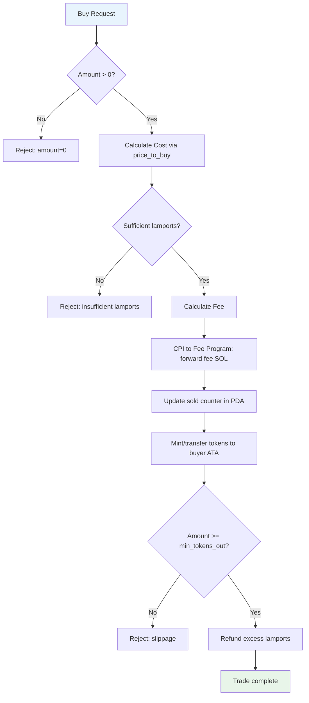
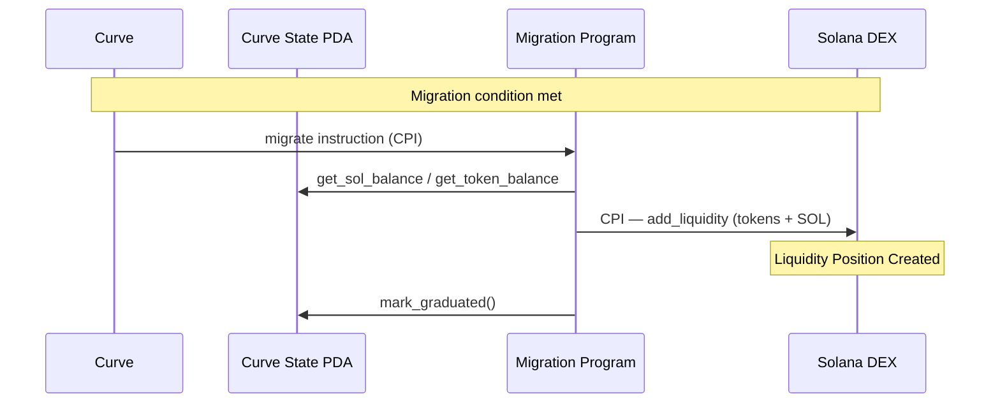

# Bonding Curve Technical Specification

See [PROTOCOL.md](./PROTOCOL.md) for the authoritative protocol architecture. This document covers bonding curve mechanics in detail.

**Chain:** Solana (`mainnet-beta`) · **Token Standard:** SPL Token · **Native Asset:** SOL (lamports)

---

## Table of Contents

1. [Introduction](#introduction)
2. [Mathematical Foundation](#mathematical-foundation)
3. [Program Architecture](#program-architecture)
4. [Pricing Algorithm](#pricing-algorithm)
5. [Trade Execution](#trade-execution)
6. [Curve Parameters](#curve-parameters)
7. [Migration Triggers](#migration-triggers)
8. [Virtual vs Real Reserves](#virtual-vs-real-reserves)
9. [Security Considerations](#security-considerations)
10. [Compute Budget](#compute-budget)

---

## Introduction

The bonding curve is a core component of the FartBull ecosystem, providing automated price discovery for newly launched SPL tokens. It operates as a deterministic pricing mechanism where token price is calculated based on the number of tokens already sold.

### Key Properties

1. **Deterministic Pricing**: Price follows a mathematical formula with no external dependencies
2. **Continuous Liquidity**: Tokens available for purchase at all times during the trading phase
3. **Immutable Parameters**: Curve settings fixed after initialization
4. **Transparent Mechanics**: All calculations verifiable on-chain in PDA state
5. **Fair Distribution**: Equal opportunity for all participants

### Bonding Curve vs Traditional AMM

| Feature | Bonding Curve | Traditional AMM (e.g. Raydium) |
|---------|---------------|-------------------------------|
| Price Discovery | Mathematical formula | Supply/demand ratios |
| Liquidity Source | Program-controlled reserves | External liquidity providers |
| Price Impact | Predictable | Proportional to trade size |
| Token Availability | Finite (until migration) | Unlimited |
| Migration Requirement | Yes, required | No |

---

## Mathematical Foundation

### Linear Price Function

The core pricing model uses a linear function:

```
P(s) = b + s × n
```

Where:
- `P(s)` = Current price per token (lamports per token base unit)
- `b` = Base price (lamports per token)
- `s` = Slope coefficient (price increment per token)
- `n` = Tokens sold so far (in base units)

### Integral Cost Function

To calculate the exact cost of buying `x` additional tokens:

```
∫ P(n) dn = ∫(b + s×n) dn = b×n + (s×n²)/2
```

Therefore, the cost to buy `x` tokens when `n` have already been sold:

```
Cost(x) = [b×(n+x) + s×(n+x)²/2] - [b×n + s×n²/2]
        = b×x + s×x×(n + x/2)
```

### Implementation Formula

All calculations are performed in integer arithmetic — there is no floating point on Solana:

```
price_to_buy(x):
    linear     = base_price × x                              // b×x
    slope_part = slope × (x × sold + (x × (x + 1)) / 2)     // s×x×(n + x/2)
    return linear + slope_part
```

Note: `(x × (x + 1)) / 2` is used instead of `x²/2` to handle integer division correctly for discrete token pricing.

### Unit Definitions

| Unit | Description |
|------|-------------|
| **lamport** | Smallest unit of SOL (1 SOL = 1,000,000,000 lamports) |
| **SOL** | Human-readable native asset (1 SOL = 1e9 lamports) |
| **token base unit** | Smallest unit of the SPL token (respecting mint decimals) |
| **token (human)** | Human-readable token amount (1 token = 10^decimals base units) |

All program calculations use **lamports** and **token base units**. Never mix SOL and lamports without explicit conversion. Never mix human-readable token units and base units without explicit conversion.

---

## Program Architecture

### Bonding Curve Program

The Bonding Curve Program maintains its state in a **Bonding Curve State PDA** (program-derived address). The program itself is stateless; mutable data lives in the state PDA.

```
User Wallet
     |
     v
Bonding Curve Program
     |
     v
Bonding Curve State PDA
     |
     +--> mint → SPL Token Mint
     +--> sold (tokens sold counter)
     +--> total_supply (curve allocation)
     +--> base_price, slope, fee_bps, platform_fee_bps
     +--> graduated (frozen after migration)
     |
     v
Fee Program (via CPI)
     |
     v
Fee Config PDA (per-token accounting)
```

### State PDA Fields

| Field | Type | Mutability | Description |
|-------|------|------------|-------------|
| `mint` | Pubkey | immutable | SPL Token Mint reference |
| `fee_config_pda` | Pubkey | immutable | Fee Program per-token PDA |
| `base_price` | u64 | immutable | Starting price per token (lamports) |
| `slope` | u64 | immutable | Price increment per token (lamports) |
| `fee_bps` | u64 | immutable | Trading fee in basis points |
| `platform_fee_bps` | u64 | immutable | Protocol revenue taken first |
| `sold` | u64 | mutable | Tokens sold counter (base units) |
| `total_supply` | u64 | immutable | Max tokens for curve (800,000,000 base units) |
| `graduated` | bool | mutable | Whether migration has completed |

### PDA Seeds

The Bonding Curve State PDA seeds are `TBD — PDA seeds`. Do not invent seeds until the implementation defines them.

---

## Pricing Algorithm

### Step-by-Step Execution Flow



### Slippage Protection

Built-in slippage control allows buyers to set the minimum expected tokens:

```
buy(amount, min_tokens_out, max_lamports_in):
    if amount == 0:
        error "amount=0"

    cost = price_to_buy(amount)

    if max_lamports_in < cost:
        error "insufficient lamports"

    fee = (cost × fee_bps) / 10,000

    # CPI: forward fee to Fee Program
    if fee > 0:
        fee_program.on_trade(fee_config_pda, fee)

    sold += amount  # state update before token transfer (effects before interactions)

    # SPL Token Program CPI: mint/transfer tokens to buyer's ATA
    spl_token.mint_to_or_transfer(mint, buyer_ata, amount)

    if amount < min_tokens_out:
        # Reverts — tokens already minted but no lamport refund happens
        error "slippage"

    # Refund excess lamports to buyer
    if max_lamports_in > cost:
        system_program.transfer(payer, amount_paid - cost)

    emit TradeEvent {
        buyer, amount, cost, fee, slot, signature
    }
```

### Oversized Final Buy

If a buyer requests more tokens than the curve is permitted to sell, the purchase is capped at the remaining curve inventory:

```
Requested Amount
       |
       v
Remaining Curve Inventory
       |
       v
Maximum Permitted Fill
       |
       v
Calculate Required lamports (price_to_buy)
       |
       v
Refund Excess lamports
```

The buyer must never receive tokens belonging to the liquidity migration allocation. The curve PDA holds only `total_supply - sold` tokens available for purchase.

---

## Curve Parameters

### Configuration Options

Each curve is initialized with immutable parameters:

| Parameter | Range | Default | Unit |
|-----------|-------|---------|------|
| `base_price` | 1e12 – 1e18 | 1e15 | lamports per token |
| `slope` | 0 – 1e12 | 1e10 | lamports per token² |
| `fee_bps` | 100 – 500 | 200 | basis points |
| `total_supply` | 1M – 1B | 1,000,000,000 | token base units |

### Parameter Selection Guidelines

#### Base Price Selection
- Too low: Early buyers benefit excessively, discouraging later participation
- Too high: Deters initial traders, slows curve progression
- Optimal: Reflects fair market value of token concept

#### Slope Selection
- Gentle slope (low): Steady price increase, longer curve duration
- Steep slope (high): Rapid price discovery, quicker migration
- Recommended: Start gentle; parameters are immutable after deployment

#### Total Supply Considerations
- Smaller supply: Higher per-token value, easier marketing targets
- Larger supply: More accessible pricing, broader distribution
- Sweet spot: Balance accessibility with perceived value

---

## Migration Triggers

### Migration Condition

Migration is triggered when the bonding curve reaches its configured migration condition. The exact threshold values are **TBD** — they are not obtained by converting any prior native-token target to SOL. The canonical migration architecture is defined in [MIGRATION.md](./MIGRATION.md).

### Current Design Target

```
~750,000,000 tokens
```

triggers migration. The remaining portion is treated as a controlled migration buffer rather than unrestricted curve inventory.

### Migration Process Flow



### Migration Buffer

The migration buffer exists to handle:

- Final/in-flight buys at the migration boundary
- Preventing accidental sale of liquidity allocation tokens
- Migration edge-case protection

Unused buffer tokens should follow the explicitly agreed burn mechanism. If the final burn destination is not yet finalized in the Solana implementation:

```
TBD — burn destination
```

Do not invent a fake Solana address.

### Post-Migration State

After successful migration:

| Component | Status |
|-----------|--------|
| Bonding Curve State PDA | Frozen (no trades) |
| Token Trading | Active on Solana DEX (`TBD`) |
| Liquidity Position | Created (`TBD — DEX liquidity-position model`) |
| Fee Source | Switched to DEX trading fees |
| Fee Processing | Continues via Fee Program |

---

## Virtual vs Real Reserves

The documentation must make clear the difference between:

**VIRTUAL RESERVES** — The mathematical construct used by the bonding curve price formula. The curve's `sold` counter and `total_supply` define the virtual reserve relationship that determines price. The price at any point is `base_price + slope × sold`, which is a purely mathematical function of how many tokens have been sold.

**REAL ON-CHAIN RESERVES** — The actual lamports (SOL) held by the Bonding Curve State PDA vault account, and the actual unsold tokens held by the curve's token vault. These are the real, spendable assets used to fund migration liquidity.

Market-cap calculations (e.g., `totalSupply × currentPrice`) are a **virtual** valuation derived from the price formula — they must not be conflated with the actual SOL held by the program. The real SOL reserve is whatever lamports the Curve State PDA vault actually contains at any given time.

```text
Virtual: Price(s) = basePrice + slope × sold           ← mathematical formula
Real:    SOL in Curve State PDA vault (lamports)       ← actual on-chain balance
Real:    Unsold tokens in curve token vault (base units)← actual on-chain tokens
```

---

## Security Considerations

### Attack Vectors & Mitigations

#### 1. Account Substitution
**Risk**: An attacker passes a wrong account where the program expects a specific PDA or mint
**Mitigation**:
- Validate PDA derivation for all PDA accounts (`find_program_address` check)
- Validate mint matches the expected mint in the Curve State PDA
- Validate SPL Token Program is the expected program ID
- Verify account ownership (owner must be the expected program or SPL Token Program)

#### 2. Integer Overflow/Underflow
**Risk**: Mathematical operations exceed u64 limits
**Mitigation**: Use checked arithmetic (`checked_mul`, `checked_add`) with explicit error handling. Rust panics on overflow only in debug mode — Solana programs must use checked operations in release.

#### 3. Front-Running
**Risk**: Bots exploit pending transactions for profit
**Mitigation**: Slippage protection parameters (`min_tokens_out`), compute-unit priority fees for user transactions

#### 4. PDA Derivation Bypass
**Risk**: An attacker constructs an account that mimics a PDA without correct seeds
**Mitigation**: Verify PDA bump and seeds on every instruction that accepts a PDA

#### 5. Reinitialization
**Risk**: An attacker re-initializes a state PDA to overwrite parameters
**Mitigation**: Check `is_initialized` flag in state PDA; reject if already initialized

### Access Control Matrix

| Instruction | Caller | Permission |
|-------------|--------|------------|
| `buy` | Any wallet | Public |
| `price_to_buy` | Any | View |
| `current_price` | Any | View |
| `get_sol_balance` | Any | View |
| `migrate` (mark_graduated) | Migration Program | Restricted (CPI-verified PDA signer) |

### Checks-Effects-Interactions in Solana

Solana has no reentrant call risk (CPIs do not re-enter in the same execution context), but the ordering principle still applies:

1. **Validate** all accounts and signers first
2. **Update** state (effects) before
3. **Execute** token transfers / fee forwarding (interactions)

This prevents partial-state scenarios if a CPI fails.

---

## Compute Budget

### Instruction Compute Cost Estimates

| Operation | Estimated Compute Units | Notes |
|-----------|------------------------|-------|
| `price_to_buy` (view) | ~5,000 | Simple arithmetic |
| `current_price` (view) | ~5,000 | Single multiplication |
| `buy` | ~120,000 | Includes fee CPI, token mint, refund |
| `migrate` (via CPI) | ~200,000 | One-time migration cost |

> Compute unit estimates are illustrative. Actual costs depend on instruction complexity, account sizes, and CPI depth. Solana transactions have a compute budget (default 200,000 CU); complex operations may require a higher `computeUnitLimit`.

---

*Solana transaction costs are paid in lamports (SOL) per signature plus optional priority fees for compute-unit pricing. Base fee per signature is 500 lamports; priority fees are specified per compute unit.*

*Bonding curve specification last updated: August 2026*
*Next review: October 2026*
*Source of truth: [PROTOCOL.md](./PROTOCOL.md)*
