# FartBull — System Diagrams

See [PROTOCOL.md](./PROTOCOL.md) for the authoritative protocol specification. This document is a collection of all Mermaid system diagrams used in the documentation suite.

**Chain:** Solana (`mainnet-beta`) · **Token Standard:** SPL Token · **Native Asset:** SOL (lamports)

All diagrams reflect the canonical architecture: Solana, bonding curve launch, Solana DEX migration, a single shared Fee Program with per-token PDA isolation, claim-based distribution, optional marketing, top-100 snapshot governance, and CTO recovery. Plus the FartBull Agent System and Asset Registry.

---

## 1. System Architecture

### High-Level Overview

```mermaid
graph TD
    subgraph "Application Layer"
        A1[Frontend (fartbull.xyz)]
        A2[API (api.fartbull.xyz)]
    end

    subgraph "On-Chain (Solana)"
        A2 --> B1[Token Factory Program]
        B1 --> B2[SPL Token Mint<br/>via SPL Token Program]
        B1 --> B3[Bonding Curve State PDA]
        B3 --> B4[Fee Program]
        B3 --> B5[Migration Program]
        B5 --> B6[Solana DEX / AMM]
        B4 --> B7[Social Registry Program]
        B1 --> B8[Agent PDA]
        B1 --> B9[Asset Registry PDA]
    end

    subgraph "Monitoring"
        D1[Solscan Explorer]
        D2[Prometheus]
    end

    style A1 fill:#e8f4fd
    style B1 fill:#fff3e0
    style B2 fill:#fff3e0
    style B3 fill:#fff3e0
    style B4 fill:#e8f5e9
    style B5 fill:#e8f5e9
    style B6 fill:#e8f5e9
    style B7 fill:#e8f5e9
    style B8 fill:#e8f5e9
    style B9 fill:#e8f5e9
    style D1 fill:#f3e5f5
    style D2 fill:#f3e5f5
```

---

## 2. FartBull Primary Architecture

The primary diagram showing the eight conceptual modules:

```mermaid
graph TD
    subgraph "FARTBULL"
        CTR[FartBull Program]
    end

    subgraph "Modules"
        direction L
        subgraph "1. Token Launch"
            LAUNCH[Token Factory Program]
        end

        subgraph "2. Bonding Curve"
            BC[Bonding Curve Program]
            BCPDA[Bonding Curve State PDA]
        end

        subgraph "3. Fee Management"
            FEE[Fee Program]
            FEE_PDA[Fee Config Per-Token PDA]
        end

        subgraph "4. Migration"
            MIG[Migration Program]
        end

        subgraph "5. Governance"
            GOV[Governance Program]
        end

        subgraph "6. Agent System"
            AGENT[Agent PDA]
        end

        subgraph "7. Asset Registry"
            ASSET[Asset Registry PDA]
        end

        subgraph "8. Social Registry"
            SOC[Social Registry Program]
        end
    end

    CTR --> LAUNCH
    LAUNCH --> BC
    LAUNCH --> AGENT
    LAUNCH --> ASSET
    BC --> BCPDA
    BCPDA --> FEE
    BCPDA --> MIG
    FEE --> FEE_PDA
    FEE --> SOC
    MIG --> LP[Liquidity Position (TBD)]
    LP --> DEX[Solana DEX / AMM]
    GOV --> GOV_PDA[Governance PDA]

    style CTR fill:#e8f4fd
    style LAUNCH fill:#fff3e0
    style BC fill:#fff3e0
    style BCPDA fill:#fff3e0
    style FEE fill:#e8f5e9
    style FEE_PDA fill:#e8f5e9
    style MIG fill:#e8f5e9
    style GOV fill:#e8f5e9
    style AGENT fill:#e8f5e9
    style ASSET fill:#e8f5e9
    style SOC fill:#e8f5e9
    style DEX fill:#e8f5e9
    style LP fill:#e8f5e9
```

---

## 3. Token Launch

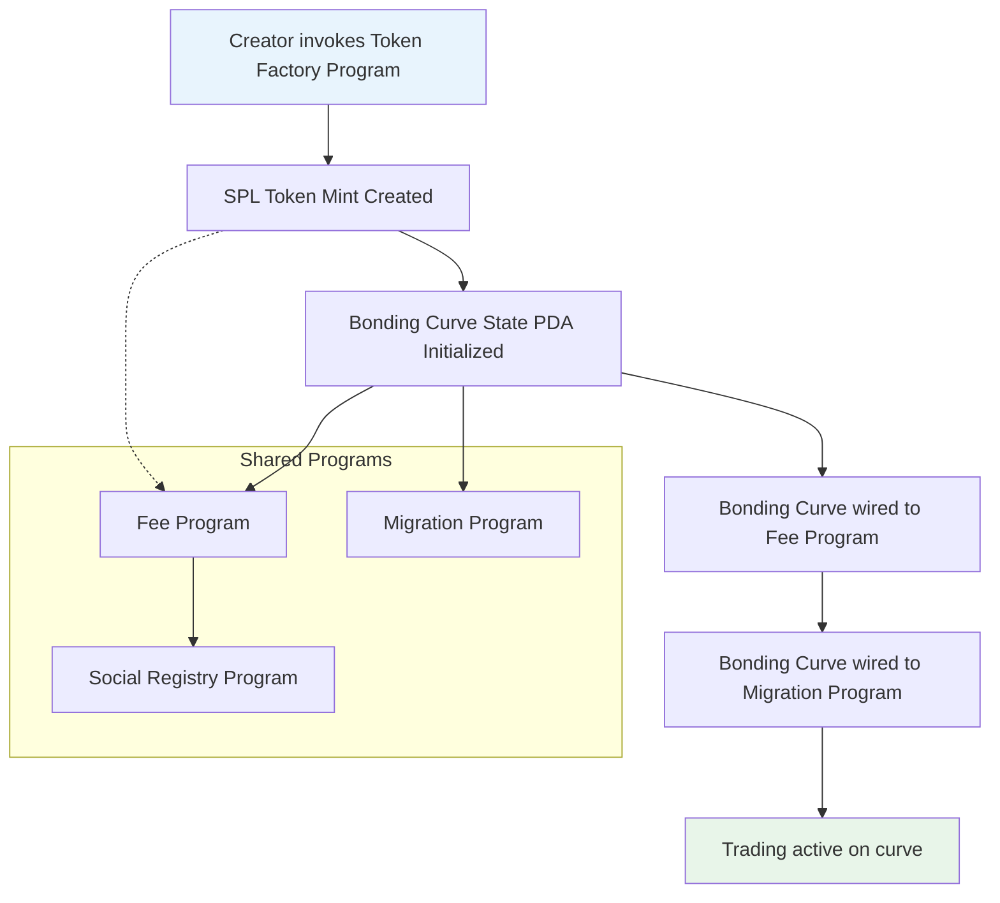

---

## 4. Bonding Curve

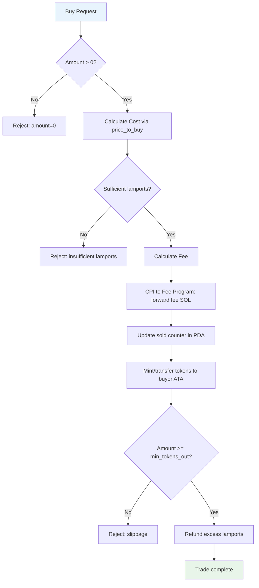

---

## 5. Fee Flow

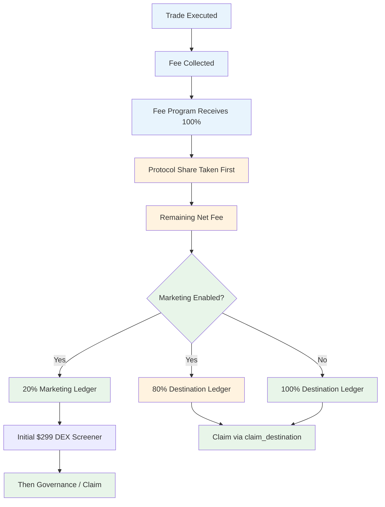

---

## 6. Fee Program Accounting

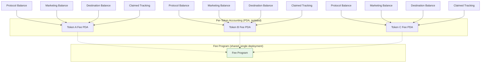

---

## 7. Destination Claim

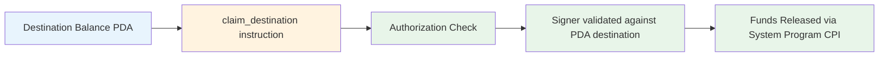

---

## 8. Marketing

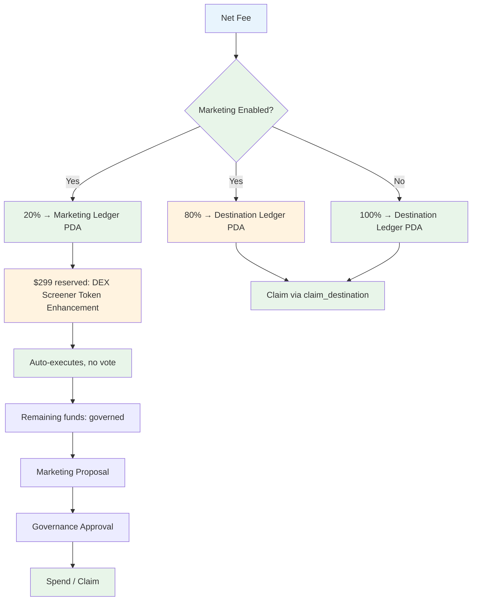

---

## 9. Marketing Governance

```mermaid
sequenceDiagram
    participant Creator
    participant Trader
    participant Curve
    participant FP as Fee Program
    participant GOV as Governance Program
    participant V as Voters

    Note over Curve,FP: Bonding curve trading
    Trader->>Curve: buy with SOL
    Curve->>FP: CPI — forward fee
    FP->>FP: protocol share first; marketing 20%, destination 80%
    Note over FP: Marketing balance accrues

    Creator->>GOV: submit marketing proposal
    GOV->>V: snapshot top 100; voting 7 days
    V->>V: cast votes
    V->>GOV: tally
    GOV->>FP: CPI — execute approved spend
    FP->>FP: release marketing funds
```

---

## 10. CTO Governance

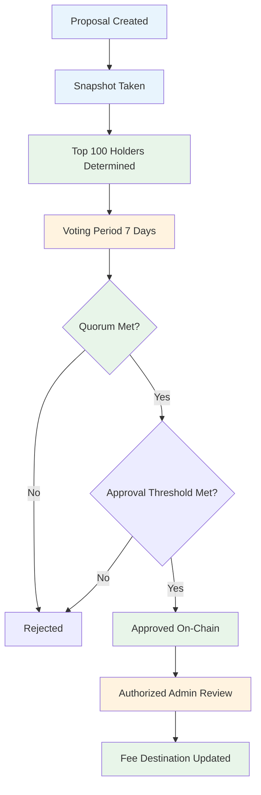

---

## 11. Social Registry

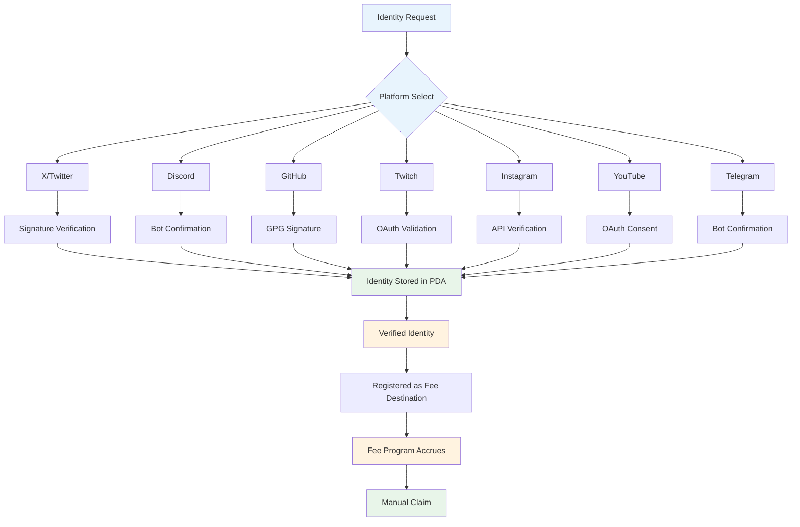

---

## 12. Migration Flow

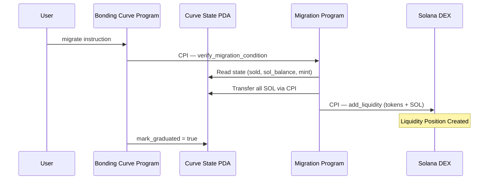

---

## 13. Token Lifecycle

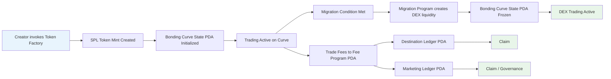

---

## 14. Agent System

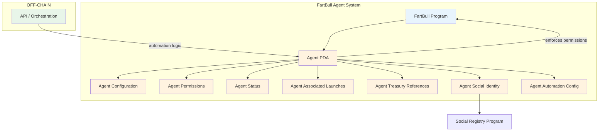

---

## 15. On-Chain vs Off-Chain

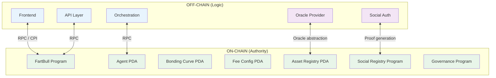

---

*System diagrams last updated: August 2026*
*Next review: October 2026*
*Source of truth: [PROTOCOL.md](./PROTOCOL.md)*
