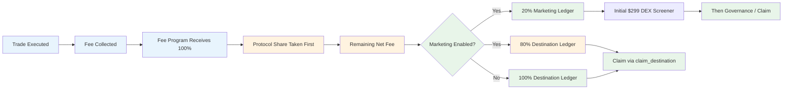

# FartBull — Fee Program Specification

See [PROTOCOL.md](./PROTOCOL.md) for the authoritative fee architecture. This document provides implementation-level details for the FartBull Fee Program.

**Chain:** Solana (`mainnet-beta`) · **Token Standard:** SPL Token · **Native Asset:** SOL (lamports)

---

## Table of Contents

1. [Fee Structure Overview](#fee-structure-overview)
2. [Fee Program Accounting](#fee-program-accounting)
3. [Fee Flow](#fee-flow)
4. [Platform Revenue](#platform-revenue)
5. [Marketing Configuration](#marketing-configuration)
6. [Claims](#claims)
7. [Migration Fee Behavior](#migration-fee-behavior)
8. [Safety Controls](#safety-controls)

---

## Fee Structure Overview

The Fee Program is a **single shared program** that services every launched token. There is exactly one Fee Program for the entire protocol — no per-token fee programs are deployed. It collects fees from Bonding Curve trades (pre-migration) and Solana DEX fees (post-migration), maintaining isolated per-token accounting in dedicated PDA state accounts.

### Dual Revenue Architecture

1. **Protocol Revenue** — A protocol-level percentage taken from every trade fee (deducted first)
2. **Net Fee** — The remaining portion, split between destination and marketing

```
Gross Fee
↓
Protocol Share
↓
Net Fee (available for split)
↓
Marketing Split (if enabled) or Full to Destination
```

### Fee Components

| Component | Range | Purpose |
|-----------|-------|---------|
| **Trading Fee** | 100–500 BPS (1–5%) | Collected per trade on the Bonding Curve |
| **Protocol Fee** | Configurable (default 200 BPS = 2%) | Protocol revenue, deducted first |
| **Marketing Split** | 0% or 20% of net fee | Marketing ledger (optional) |
| **Destination** | 80% or 100% of net fee | Creator-selected routing |

---

## Fee Program Accounting

The Fee Program maintains fully isolated balances per token. Each token's accounting lives in a dedicated PDA state account — no cross-token accounting occurs.

### Per-Token State Account (PDA)

For each token, the Fee Program tracks in a dedicated state PDA:

| Field | Type | Description |
|-------|------|-------------|
| `protocol_balance` | u64 (lamports) | Protocol revenue share |
| `marketing_balance` | u64 (lamports) | Marketing ledger funds |
| `destination_balance` | u64 (lamports) | Creator-selected destination funds |
| `claimed_balance` | u64 (lamports) | Tracking of claimed amounts |
| `marketing_enabled` | bool | Whether marketing split is active |
| `destination` | Pubkey | Claim destination (wallet or verified social identity) |

No mappings, no shared mutable storage — each token has its own PDA account. The accounting invariant:

```
fees received = protocol allocation + marketing allocation + destination allocation + legitimately claimed amounts
```

The accounting for Token A must never affect Token B. This is a core protocol security invariant.

### Account Ownership Model

The Fee Program PDA accounts are **owned and controlled by the Fee Program**. Funds sent to these accounts can only be moved via valid Fee Program instructions. The Fee Program validates the PDA derivation on every instruction — no account substitution is possible without matching the canonical PDA seeds.

---

## Fee Flow



### Plain-English Flow

```
Gross Trade Fee (lamports)
↓
Fee Program receives 100%
↓
Protocol Share (taken first)
↓
Remaining Creator Fee
↓
Marketing Enabled? → Yes: 20% Marketing, 80% Destination
                  No: 100% Destination
↓
Manual Claim via Fee Program
```

The platform/protocol share is taken **before** the optional marketing split. The 20/80 marketing split is calculated only on the remaining amount after the platform share. Do **not** calculate marketing as 20% of the gross trade fee.

The 20% marketing split is completely unrelated to the 200,000,000 token supply allocation.

---

## Platform Revenue

The Fee Program takes its platform allocation first.

```
Gross Trading Fee (lamports)
        |
        v
Protocol Share
        |
        v
Remaining Creator Allocation
        |
        +---- 80% Destination
        |
        +---- 20% Marketing
```

```
// 1. Protocol revenue taken first
protocol_share = (gross_fee × platform_fee_bps) / 10,000
fee_config.protocol_balance += protocol_share

// 2. Remaining fee
remaining = gross_fee - protocol_share

// 3. Marketing split (if enabled) — 20% of the REMAINING amount
if fee_config.marketing_enabled:
    marketing_portion = (remaining × MARKETING_BPS) / 10,000  // MARKETING_BPS = 2000
    fee_config.marketing_balance += marketing_portion
    fee_config.destination_balance += remaining - marketing_portion  // 80% of net
else:
    fee_config.destination_balance += remaining
```

Where `MARKETING_BPS = 2000` (20% of the net fee). The protocol share is **not** a marketing destination — it is taken before the split and is unrelated to the 200,000,000 token supply allocation.

The protocol share accrues to the protocol treasury PDA and is claimable by the authorized protocol admin.

---

## Marketing Configuration

Marketing is **optional**. Creators enable or disable it per token at launch.

### When Marketing is Enabled

```
Net Fee (lamports)
↓
20% → Marketing Ledger
80% → Destination Ledger
```

### When Marketing is Disabled

```
Net Fee (lamports)
↓
100% → Destination Ledger
0% → Marketing (none)
```

### Initial Mandatory Marketing Spend

When marketing is enabled, the first $299 USD equivalent of accumulated marketing funds is automatically reserved for **DEX Screener Token Enhancement**. This:

- Requires no governance vote
- Executes automatically via protocol logic
- Is the protocol's mandatory first marketing action

After the initial $299 enhancement completes, marketing funds become subject to community governance proposals.

> **Note:** DEX Screener is an off-chain analytics and visibility service. The threshold is an off-chain execution milestone triggered by on-chain accounting in the Fee Program PDA. Do not pretend DEX Screener is a Solana on-chain program.

### Marketing Percentage

| Setting | Behavior |
|---------|----------|
| `marketing_enabled = false` | No marketing allocation; 100% to destination |
| `marketing_enabled = true` | 20% of net fee to marketing, 80% to destination (fixed split) |

---

## Claims

Fees accumulate on-chain in PDA-controlled vault accounts. Recipients do **not** receive automatic transfers. They must invoke the appropriate claim instruction to withdraw their accumulated SOL balance.

### Destination Claims

The registered destination invokes `claim_destination` to withdraw accumulated destination funds:

```
claim_destination(fee_config_pda):
    verify signer == fee_config.destination
    amount = fee_config.destination_balance
    fee_config.destination_balance = 0
    system_program.transfer(fee_config_pda, signer, amount)
```

Only the authorized destination for the token may claim the destination balance. Funds are released on demand — they are never pushed automatically.

### Protocol Claims

The authorized protocol admin claims protocol revenue:

```
claim_protocol(fee_config_pda):
    verify signer == protocol_admin
    amount = fee_config.protocol_balance
    fee_config.protocol_balance = 0
    system_program.transfer(fee_config_pda, signer, amount)
```

### Marketing Claims

Marketing funds are either:

- Automatically spent (initial $299 DEX Screener enhancement)
- Claimed or spent via governance proposals

```
claim_marketing(fee_config_pda):
    verify caller authorized via governance
    amount = fee_config.marketing_balance
    fee_config.marketing_balance = 0
    system_program.transfer(fee_config_pda, caller, amount)
```

### Authorization Checks

Each claim path performs an authorization check before releasing funds:

```
Destination Balance (PDA)
       |
       v
claim_destination instruction
       |
       v
Authorization Check (signer validated against PDA destination)
       |
       v
Funds Released (SOL transferred via System Program CPI)
```

The protocol balance is claimable only by the authorized protocol admin. Marketing funds are claimable/spendable only via passing governance proposals. Destination funds are claimable only by the registered destination (wallet or verified social identity).

---

## Migration Fee Behavior

### Pre-Migration

| Fee Type | Source | Recipient |
|----------|--------|-----------|
| Trade Fees | Bonding Curve trades | Fee Program |

### Post-Migration

| Fee Type | Source | Recipient |
|----------|--------|-----------|
| DEX Fees | Solana DEX trading | Fee Program |

The Fee Program does **not** change across migration. Only the fee source switches from the Bonding Curve to the Solana DEX. The same accounting, routing, and claim logic applies in both phases.

---

## Safety Controls

### Input Validation

The Fee Program validates all inputs on every instruction:

- **Signer validation**: Required signers must be present
- **PDA derivation**: All PDA accounts verified via `find_program_address`
- **Account ownership**: All accounts validated as owned by the expected program
- **Lamport balance**: PDA must hold sufficient lamports before transfer

### Accounting Isolation

- Each token has its own Fee Config PDA account
- No function reads or writes another token's balances
- Cross-token mixing is a protocol security invariant violation

### Fee Calculation Invariant

```
Output: protocol_balance + marketing_balance + destination_balance + legitimately_claimed
Input:  total fees received
Invariant: Output == Input (for any given token)
```

The Fee Program must never create or destroy lamports — fees are distributed, not minted.

---

*Fee engine specification last updated: August 2026*
*Next review: October 2026*
*Source of truth: [PROTOCOL.md](./PROTOCOL.md)*
