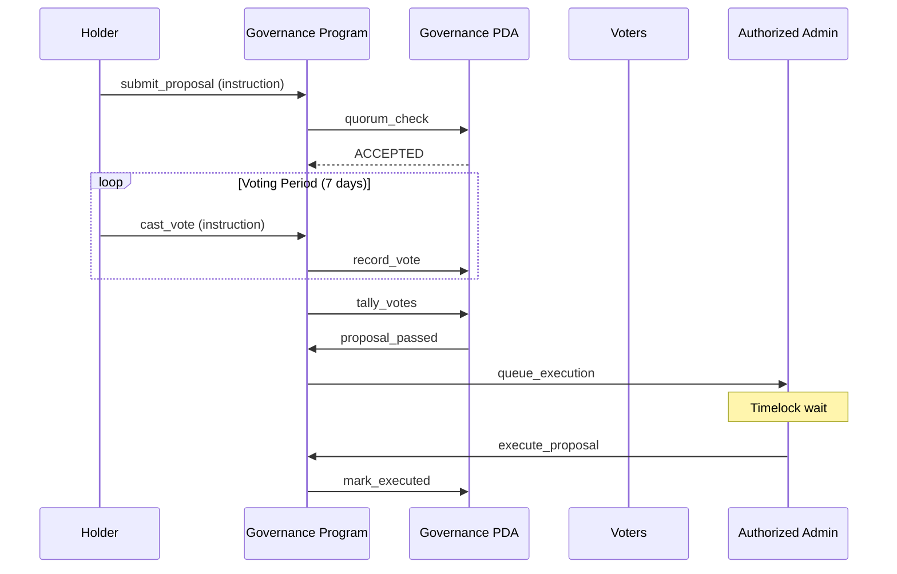
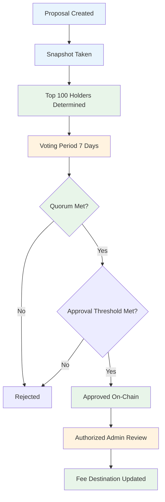

# FartBull — Governance Framework

See [PROTOCOL.md](./PROTOCOL.md) for the authoritative protocol specification. This document covers governance mechanics for marketing proposals and CTO recovery.

**Chain:** Solana (`mainnet-beta`) · **Token Standard:** SPL Token · **Native Asset:** SOL (lamports)

---

## Table of Contents

1. [Governance Overview](#governance-overview)
2. [Governance Scope](#governance-scope)
3. [Voting Mechanics](#voting-mechanics)
4. [Proposal Lifecycle](#proposal-lifecycle)
5. [Quorum Requirements](#quorum-requirements)
6. [Marketing Governance](#marketing-governance)
7. [CTO Recovery](#cto-recovery)
8. [Anti-Manipulation](#anti-manipulation)

---

## Governance Overview

### Purpose

FartBull governance enables token holders to govern two specific areas:

1. **Marketing proposals** — per-token marketing spend voting (top 100 holders, snapshot-based)
2. **CTO recovery** — community approval to redirect fee destinations after a legitimate community takeover

### Governance Scope

Governance **does not** control:

- Protocol upgrades or program deployments
- Fee rates, fee structures, or fee parameters
- Protocol-level configurations
- Program authorities or deployments
- Token Factory, Fee Program, Migration Program, Social Registry Program, or Agent Program internals

These are protocol-administered and outside governance scope.

### Core Principles

1. **Transparency** — All proposals and votes publicly auditable on Solana
2. **Inclusivity** — Token holders within the eligible set can participate
3. **Snapshot-based** — Balances frozen at proposal creation
4. **Isolation** — Per-token voting, never global token voting
5. **Authority separation** — Governance approval ≠ administrative execution

---

## Governance Token

The governance token is the launched FartBull token itself — the same SPL token used on the bonding curve. No separate governance token distribution is required.

```
Token holders in the top 100 at snapshot = Potential voters
Voting power = Token balance at snapshot
No lock-up required for participation
```

### Solana Holder Resolution

Solana token balances are held in **token accounts** / **Associated Token Accounts (ATAs)**. The governance system must resolve ownership and balances correctly:

- Each token account identifies the **mint** and the **owner** (wallet)
- An owner may hold balances in multiple token accounts for the same mint
- The governance system must aggregate balances across all token accounts for a given owner
- The **owner** field of the token account is the voting entity, not the token account address itself

Do not simply say "get top 100 wallets" without explaining how token accounts are mapped to owners. The governance system queries all token accounts for the mint, reads the `owner` field, and aggregates balances per owner.

```
SPL Mint
    |
    +--> Token Accounts (each has owner + balance)
            |
            v
    Aggregate by owner across all token accounts
            |
            v
    Top 100 owners by total balance
```

---

## Voting Mechanics

### Snapshot Voting

Votes are snapshotted at the snapshot slot set when a proposal is created:

```
proposalSlot = current_slot + N (snapshot window)
voteEndsAt = proposalSlot + votingDuration
```

At proposal creation, the top 100 token holders are determined and their balances are **frozen** as the snapshot. Subsequent token transfers do not affect voting power. This prevents balance manipulation during the voting period.

### Snapshot Implementation (Solana)

The snapshot is recorded in a Governance State PDA:

| Field | Type | Description |
|-------|------|-------------|
| `proposal_id` | u64 | Unique proposal identifier |
| `mint` | Pubkey | Token mint being voted on |
| `snapshot_slot` | u64 | Slot at which balances were frozen |
| `voter_set` | Vec<(Pubkey, u64)> | Top 100 voters and their frozen balances |
| `votes_for` | u64 | Total votes for |
| `votes_against` | u64 | Total votes against |
| `votes_abstain` | u64 | Total abstentions |
| `start_slot` | u64 | Voting start slot |
| `end_slot` | u64 | Voting end slot |
| `executed` | bool | Whether proposal has been executed |

### Vote Weight Calculation

```
voteWeight = tokenBalanceAtSnapshot (aggregated across all token accounts for the owner)
```

### Vote Types

| Vote | Meaning | Effect |
|------|---------|--------|
| **For** | Support proposal | Increases approval weight |
| **Against** | Oppose proposal | Counts as no |
| **Abstain** | No opinion | Weight counted toward quorum but not approval |

### Voting Period

- **Duration:** 7 days per proposal (measured in slots)
- **Eligibility:** Top 100 token holders by balance at proposal creation
- **Quorum:** 5% of total supply must participate
- **Approval threshold:** `TBD — final governance approval threshold`

The snapshot-based voting prevents balance manipulation during the voting period. Votes are recorded on-chain in program state and publicly verifiable.

---

## Proposal Lifecycle



### Detailed States

| State | Description | Actions Allowed |
|-------|-------------|-----------------|
| **Pending** | Proposal submitted, awaiting quorum check | Vote |
| **Active** | Voting period open | Vote only |
| **Succeeded** | Vote passed, queued for execution | Execute only |
| **Failed** | Vote did not pass threshold | None |
| **Queued** | Passed, waiting for execution | None |
| **Executed** | Action completed | None |
| **Canceled** | Emergency cancellation | None |

---

## Quorum Requirements

### Minimum Participation

```
quorum = totalSupply × 0.05 (5%)
```

For a 1,000,000,000 supply: 50,000,000 tokens required for quorum.

### Approval Thresholds

| Proposal Type | Threshold |
|---------------|-----------|
| Marketing | `TBD — final governance approval threshold` |
| CTO Recovery | `TBD — final governance approval threshold` |

The final approval threshold is TBD and applies uniformly to all proposal types. Do not invent a threshold (50%, 60%, 66%, 75%, 80%) — it must be one canonical value once finalized.

---

## Marketing Governance

### Purpose

Top 100 holders vote on how marketing funds for a specific token should be spent. This is **per-token**, never global.

### Voting Categories (Per Token)

| Category | Description | Governance Required |
|----------|-------------|---------------------|
| DEX Screener Boost | Token visibility enhancement | Yes |
| Additional DEX Screener Services | Further DEX tools | Yes |
| Social Media Campaign | Social platform promotion | Yes |
| Exchange Listing Application | Apply to exchanges | Yes |
| Influencer Campaign | Creator/affiliate payments | Yes |
| Community Promotion | User distribution | Yes |

Do not imply that every category is automatically integrated on-chain. If an action requires an external service:

```
On-chain governance approves expenditure
+
external execution mechanism performs the service
```

Keep that boundary clear.

### Current Status

The first $299 USD equivalent of marketing funds (when enabled) is automatically reserved for **DEX Screener Token Enhancement** without governance. After this initial spend, marketing proposals require governance approval.

---

## CTO Recovery

### Purpose

Allow community approval to redirect fee destinations after a legitimate community takeover (CTO).

### Flow



### Authorization Checks

The admin execution step is explicit. Governance does **not** directly modify the fee route. The flow is:

```
Community approval
+
Administrative execution
```

- The on-chain governance record proves the approval occurred (snapshot + votes recorded in PDA state).
- The authorized administrator reviews the approval record.
- The administrator executes the actual Fee Program destination configuration change.
- The administrator cannot legitimately bypass the required governance approval — execution must reference a passed proposal.

**ON-CHAIN GOVERNANCE APPROVAL** ≠ **ADMINISTRATIVE EXECUTION**

Governance can establish:
"the eligible governance participants approved this change"

while the actual privileged authority (the admin) may still need to execute the change. The governance record is the on-chain proof of consensus; the admin role is the execution authority.

The exact authorization identity and CTO approval threshold are `TBD — final CTO approval threshold`.

---

## Anti-Manipulation

A holder cannot simply split tokens across multiple wallets to manipulate eligibility. The following protections apply:

| Mechanism | Description | Status |
|-----------|-------------|--------|
| **Snapshot** | Balances frozen at proposal creation slot | Implemented (design) |
| **Eligibility period** | Top 100 determined at snapshot only | Implemented (design) |
| **Minimum holding duration** | Tokens must be held at snapshot to be counted | `DESIGN OPTION` |
| **Balance snapshot** | Frozen at a single slot; later transfers ignored | Implemented (design) |
| **Anti-splitting analysis** | Detect wallets controlled by the same private key | `DESIGN OPTION` |
| **Anti-flash-loan equivalent** | Solana has no flash loans on-chain | N/A (Solana-native) |

`DESIGN OPTION` mechanisms are proposed but not yet selected. Do not present them as finalized.

### Wallet Splitting Considerations

Document honestly: the verification system does **not** magically identify every wallet controlled by the same human. A person can potentially split holdings across addresses before registration. There is no on-chain identity binding that perfectly detects shared ownership.

The snapshot-based model prevents *during-vote* manipulation. It does not prevent *before-snapshot* accumulation. Preventing users from artificially pushing other holders out of the eligible set requires additional off-chain analysis or a minimum holding duration, both of which are `DESIGN OPTION`.

---

*Governance framework last updated: August 2026*
*Next review: October 2026*
*Source of truth: [PROTOCOL.md](./PROTOCOL.md)*
