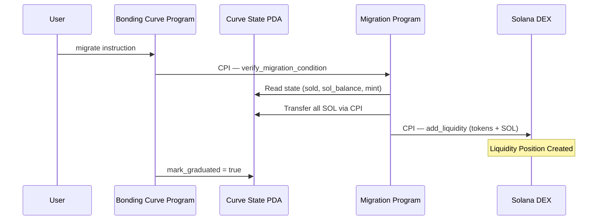

# FartBull — Liquidity Migration Specification

See [PROTOCOL.md](./PROTOCOL.md) for the authoritative migration lifecycle. This document provides detailed technical specifications.

**Chain:** Solana (`mainnet-beta`) · **Token Standard:** SPL Token · **Native Asset:** SOL (lamports) · **Destination:** Solana DEX / AMM (`TBD`)

---

## Overview

Liquidity migration transitions a token from the Bonding Curve trading environment to a Solana DEX. This process is triggered when the bonding curve reaches its configured migration condition.

The migration architecture is:

```
Bonding Curve State PDA
      |
      v
Migration Condition Reached
      |
      v
Migration Program
      |
      v
Prepare Migration Assets
      |
      v
Solana DEX / AMM
      |
      v
Liquidity Created
      |
      v
Bonding Curve State PDA Frozen
      |
      v
DEX Trading Begins
```

---

## Migration Trigger

Migration is triggered when the bonding curve reaches its configured migration condition. The exact threshold values are **TBD** — they are not obtained by converting any prior native-token target to SOL. The trigger mechanism categories are:

1. **Supply-based** — a proportion of the curve supply sold
2. **Native-asset-balance-based** — SOL accumulated in the curve
3. **Slot-based** — a deadline since curve activation

Specific threshold values for each condition are TBD and will be established by the canonical implementation.

### Current Design Target

```
~750,000,000 tokens
```

triggers migration. The remaining portion is treated as a controlled migration buffer rather than unrestricted curve inventory.

---

## Migration Process

### Migration Execution Flow



### Asset Retrieval

During migration:

1. Migration Program retrieves all SOL (lamports) from the Bonding Curve State PDA vault
2. Migration Program retrieves all unsold tokens from the curve's token vault
3. Liquidity is added to a Solana DEX (`TBD — DEX selection`) (SOL + tokens) via CPI
4. A liquidity position is created on the Solana DEX
5. The Bonding Curve State PDA is marked as graduated (frozen)

### Safe Migration Accounting

Migration must safely account for:

- **SOL available for liquidity** — total lamports in the Curve State PDA vault
- **Tokens allocated to liquidity** — unsold tokens from the curve's token vault
- **Tokens remaining after the migration allocation** — the migration buffer
- **Pending/excess purchases** — final buys at the migration boundary
- **Refunds** — excess lamports from oversized final buys
- **Fees** — remaining fee balances in the Fee Program PDA
- **Migration state** — graduated flag in the Curve State PDA
- **LP position ownership** — TBD — DEX liquidity-position model
- **LP locking** — TBD — LP locking mechanism

### Account Requirements

The Migration Program requires the following accounts to be passed in the migration instruction:

| Account | Role | Owner |
|---------|------|-------|
| `migration_signer` | PDA signer for CPI authority | Migration Program |
| `bonding_curve_state` | Curve state PDA | Bonding Curve Program |
| `mint` | SPL Token Mint | SPL Token Program |
| `curve_token_vault` | Curve's token vault ATA | SPL Token Program |
| `dex_pool` | DEX pool account | DEX Program |
| `dex_program` | Solana DEX Program | DEX Program |
| `spl_token_program` | SPL Token Program | BPF Loader |
| `system_program` | Solana System Program | BPF Loader |

The Migration Program validates:

- `bonding_curve_state` is a valid PDA derived from the Bonding Curve Program
- `mint` matches the mint stored in the Curve State PDA
- `curve_token_vault` is the correct ATA for the mint and curve PDA
- `dex_program` is a recognized Solana DEX program

### Liquidity Position Handling

The representation of the post-migration liquidity position on a Solana DEX (fungible LP tokens, NFT positions, position accounts, PDAs, or program-owned liquidity) and its custody/ownership are **TBD — DEX liquidity-position model**.

The documentation must distinguish between:

- liquidity position ownership
- liquidity custody
- liquidity fees
- protocol ownership
- destination fee accounting

Do **not** describe the liquidity position as "burned" unless the canonical implementation confirms it. Do **not** reference a burn address or "rug-pull-proof" claims.

---

## LP Safety Requirements

The documentation identifies the following LP ownership and locking requirements:

| Question | Status |
|----------|--------|
| Who owns the liquidity position? | `TBD — LP liquidity-position model` |
| How is the position represented? | `TBD — DEX liquidity-position model` |
| How is it locked? | `TBD — LP locking mechanism` |
| How long is it locked? | `TBD — LP lock duration` |
| Can it ever be unlocked? | `TBD — LP unlock conditions` |
| Who/what authority can interact with it? | `TBD — LP authority model` |
| What happens during migration failures? | `TBD — migration failure handling` |

If the existing documentation does not specify these details, they are **OPEN DESIGN QUESTIONS** — not invented answers.

### Migration Failure Handling

If migration fails (e.g., DEX CPI reverts, insufficient liquidity, price impact exceeds threshold):

- The Bonding Curve State PDA remains active (not frozen)
- All SOL and tokens remain in the Curve State PDA vault
- The migration condition can be retried
- The protocol admin is notified (off-chain)

> **Open:** Exact failure handling and rollback semantics are TBD.

---

## Post-Migration Trading

### Trading Environment

After migration:

- Trading moves to a Solana DEX (`TBD — DEX selection`)
- Standard token/SOL pair (or wrapped SOL if the DEX requires it)
- Swap fees per the DEX's configuration
- No curve-based price limits

> **Note on WSOL:** If the selected Solana DEX requires wrapped SOL (WSOL) for pool creation, document it specifically as `Wrapped SOL (WSOL)` and explain why it is required. Do not invent a WSOL dependency where one is not required.

### Fee Continuity

| Phase | Fee Source | Fee Destination |
|-------|-----------|-----------------|
| Pre-Migration | Bonding Curve trades | Fee Program |
| Post-Migration | Solana DEX trading fees | Fee Program |

The Fee Program remains unchanged across migration. Only the fee origin switches from the Bonding Curve to the Solana DEX. All accounting, routing, and claim logic continues identically.

---

## Solana Transaction Considerations

Solana transactions carry instructions that invoke programs. Migration involves:

- **Transaction signatures**: Used for identification and ordering
- **Slots**: Used for ordering and finality
- **Compute units**: Solana uses compute units with priority fees for transaction pricing
- **CPIs**: The Migration Program invokes the DEX program via cross-program invocation

The migration transaction must include:

- Sufficient compute unit limit for the CPI chain (DEX pool creation + token transfers)
- A priority fee for timely execution
- All required account descriptors (writable, signers, program-derived signers)

---

## Migration Buffer

The migration buffer exists to handle:

- Final/in-flight buys at the migration boundary
- Preventing accidental sale of liquidity allocation tokens
- Migration edge-case protection

Unused buffer tokens should follow the explicitly agreed burn mechanism. If the final burn destination is not yet finalized in the Solana implementation:

```
TBD — burn destination
```

Do not invent a fake Solana address.

---

*Migration specification last updated: August 2026*
*Next review: October 2026*
*Source of truth: [PROTOCOL.md](./PROTOCOL.md)*
