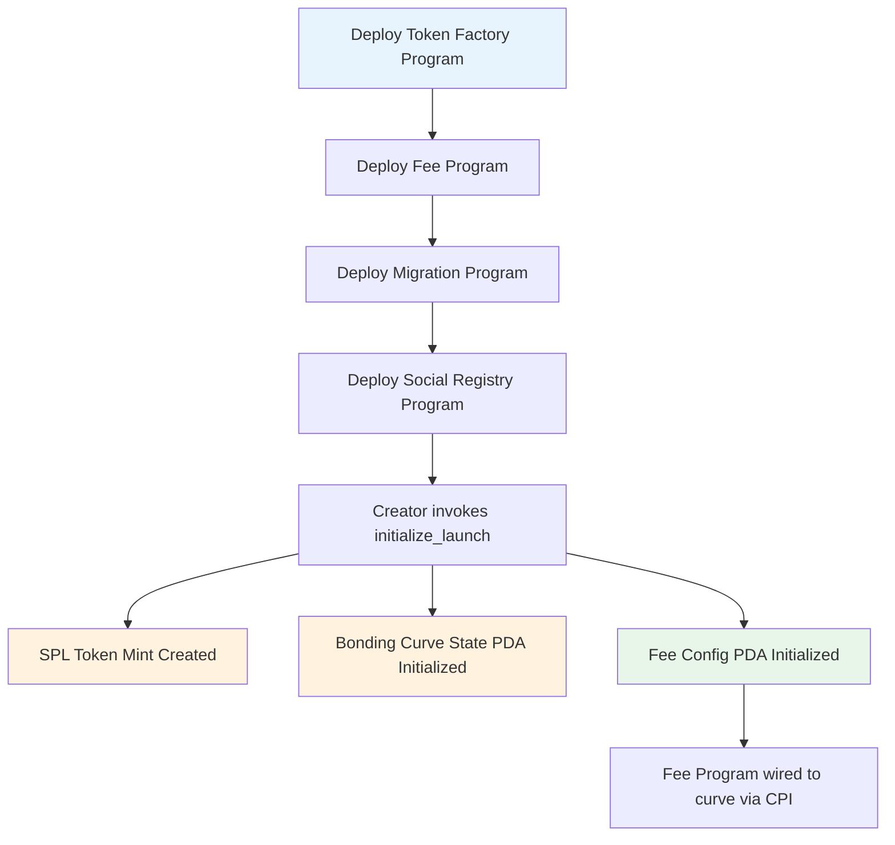
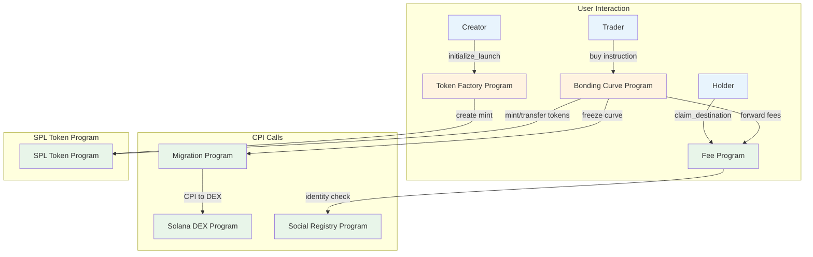

# FartBull — Solana Program Specifications

Comprehensive technical specifications for all Solana programs in the FartBull protocol.

> **Note on terminology:** Solana uses **programs**, **accounts**, **PDAs**, and **instructions**. The filename `PROGRAMS.md` reflects the Solana-native architecture; all content uses Solana terminology exclusively.

**Program IDs:** `TBD` (all programs) · **Chain:** Solana (`mainnet-beta`) · **Token Standard:** SPL Token · **Native Asset:** SOL (lamports)

See [PROTOCOL.md](./PROTOCOL.md) for the authoritative architecture specification.

---

## Table of Contents

1. [Program Architecture](#1-program-architecture)
2. [Token Factory Program](#2-token-factory-program)
3. [Bonding Curve Program](#3-bonding-curve-program)
4. [Fee Program](#4-fee-program)
5. [Migration Program](#5-migration-program)
6. [Social Registry Program](#6-social-registry-program)
7. [Governance Program](#7-governance-program)
8. [Deployment & Initialization](#8-deployment--initialization)
9. [Program Interaction](#9-program-interaction)

---

## 1. Program Architecture

| Solana Concept | Description |
|-----------------|-------------|
| Smart contract | Solana Program (executable BPF account) |
| Program state | PDA state account (program-owned) |
| Program vault | PDA vault account (program-controlled) |
| Program ID | Pubkey identifying an executable account |
| Instruction | A call to a Solana program |
| Cross-Program Invocation | Program-to-program call (CPI) |
| Signer | The wallet that signed the transaction |
| Lamports transfer | SOL (lamports) sent with the instruction |
| Token mint | SPL Token Mint (via SPL Token Program) |
| Token balance | Token Account / Associated Token Account |

### Shared vs Per-Token Accounts

| Account Type | Scope | Count |
|--------------|-------|-------|
| **Token Factory Program** | Shared | 1 |
| **Fee Program** | Shared | 1 |
| **Migration Program** | Shared | 1 |
| **Social Registry Program** | Shared | 1 |
| **Governance Program** | Shared | 1 |
| **Agent Program** | Shared | 1 (or part of Token Factory) |
| **Asset Registry Program** | Shared | 1 (or part of Token Factory) |
| **SPL Token Mint** | Per launch | Per token |
| **Bonding Curve State PDA** | Per launch | Per token |
| **Fee Config PDA** | Per launch | Per Token |
| **Agent PDA** | Per agent | Per agent |
| **Asset PDA** | Per asset | Per asset |

### Account Ownership Model

Every Solana account passed to an instruction **must** be validated:

- **Owner check** — the account owner must be the expected program (or the SPL Token Program for token accounts)
- **PDA derivation check** — PDA accounts must be verified via `find_program_address`
- **Signer check** — required signers must be present and marked as signers in the instruction
- **Writable check** — only accounts that need mutation should be marked writable

Program IDs for all shared programs: `TBD` (not yet deployed). Do not fabricate addresses.

---

## 2. Token Factory Program

### Overview

**Purpose:** Entry point for token creation. Initializes an SPL Token Mint and a Bonding Curve State PDA.
**Role:** Program that creators invoke to launch tokens
**Scope:** Single deployment, used for all subsequent launches

### Program ID

```
Token Factory Program: TBD
```

### Instructions

#### `initialize_launch`

Primary instruction for launching new tokens. Creates an SPL Token Mint and initializes a Bonding Curve State PDA.

**Accounts:**
| Account | Role | Writable | Signer |
|---------|------|----------|--------|
| `payer` | Fee payer | Yes | Yes |
| `mint` | SPL Token Mint (new) | Yes | No |
| `bonding_curve_state` | Bonding Curve State PDA (new) | Yes | No |
| `fee_config_pda` | Fee Program per-token PDA (new) | Yes | No |
| `token_factory_program` | This program | No | No |
| `fee_program` | Shared Fee Program | No | No |
| `system_program` | Solana System Program | No | No |
| `spl_token_program` | SPL Token Program | No | No |
| `rent` | Token Rent Sysvar | No | No |

**Arguments:**
| Field | Type | Description |
|-------|------|-------------|
| `name` | string | Token name |
| `symbol` | string | Token symbol (3–10 chars) |
| `decimals` | u8 | Token decimals (typically 6 or 9 for SPL) |
| `total_supply` | u64 | Total token supply in base units (1,000,000,000 × 10^decimals) |
| `base_price` | u64 | Initial price per token in lamports |
| `slope` | u64 | Price increment per token in lamports |
| `fee_bps` | u64 | Trading fee in basis points (100–500) |
| `platform_fee_bps` | u64 | Protocol revenue in basis points (deducted first) |
| `marketing_enabled` | bool | Whether marketing split is active |
| `destination` | Pubkey | Creator-selected claim destination |

### Post-Creation Actions

1. Creates the SPL Token Mint via the SPL Token Program (full supply minted to creator's ATA)
2. Initializes the Bonding Curve State PDA with token mint + curve parameters
3. Initializes the Fee Program's per-token accounting PDA (destination, marketing flag)
4. The Bonding Curve State PDA is wired to the shared Fee Program at initialization

---

## 3. Bonding Curve Program

### Overview

**Purpose:** Linear price-discovery curve state
**Curve Type:** Linear
**State:** Stored in a Bonding Curve State PDA (program-owned)
**Fee Integration:** Forwards fees to the Fee Program via CPI

### Program ID

```
Bonding Curve Program: TBD
```

### State Account (PDA)

| Field | Type | Mutability | Description |
|-------|------|------------|-------------|
| `mint` | Pubkey | immutable | SPL Token Mint reference |
| `fee_config_pda` | Pubkey | immutable | Fee Program per-token PDA |
| `base_price` | u64 | immutable | Starting price per token (lamports) |
| `slope` | u64 | immutable | Price increment per token (lamports) |
| `fee_bps` | u64 | immutable | Trading fee in basis points |
| `platform_fee_bps` | u64 | immutable | Protocol revenue taken first |
| `sold` | u64 | mutable | Tokens sold counter (base units) |
| `total_supply` | u64 | immutable | Max tokens for curve (800,000,000 base units) |
| `graduated` | bool | mutable | Whether migration has completed |

### Instructions

#### `buy`

Purchase tokens from the bonding curve.

**Accounts:**
| Account | Role | Writable | Signer |
|---------|------|----------|--------|
| `buyer` | Token buyer | Yes | Yes |
| `bonding_curve_state` | Curve state PDA | Yes | No |
| `mint` | SPL Token Mint | Yes | No |
| `buyer_ata` | Buyer's Associated Token Account | Yes | No |
| `fee_program` | Shared Fee Program | No | No |
| `fee_config_pda` | Fee Program per-token PDA | Yes | No |
| `system_program` | Solana System Program | No | No |
| `spl_token_program` | SPL Token Program | No | No |

**Arguments:**
| Field | Type | Description |
|-------|------|-------------|
| `amount` | u64 | Token base units to buy |
| `min_tokens_out` | u64 | Slippage protection floor |
| `max_lamports_in` | u64 | Maximum SOL (lamports) the buyer will pay |

**Instruction Flow:**

1. Validate accounts (owner, PDA derivation, mint matches state)
2. Verify signer (`buyer`)
3. Calculate cost via `price_to_buy(amount)` in lamports
4. Verify `max_lamports_in >= cost + fee`
5. Calculate fee: `fee = (cost * fee_bps) / 10_000`
6. CPI to Fee Program: forward fee SOL (lamports)
7. Update `sold` counter in state PDA
8. SPL Token Program CPI: mint/transfer tokens to buyer's ATA
9. Verify `amount >= min_tokens_out` (slippage check)
10. Refund excess lamports to buyer
11. Emit trade event (slot, signature, amounts)

#### `price_to_buy` (view)

Calculates total lamports required to purchase a specified amount. The cost formula:

```
Cost(x) = basePrice × x + slope × x × (n + x/2)
```

Where `x` = amount to buy, `n` = tokens already sold, all values in lamports and token base units.

Note: `(x × (x + 1)) / 2` is used instead of `x²/2` to handle integer division correctly for discrete token pricing.

#### `current_price` (view)

Returns price per token at current state:

```
currentPrice = basePrice + (sold × slope)
```

#### `get_sol_balance` (view)

Returns the SOL (lamports) balance held by the Bonding Curve State PDA vault.

#### `migrate`

Called by the Migration Program via CPI after migration triggers are met. Marks the curve as graduated (frozen).

**Authorization:** Only the Migration Program may call this (verified via program-derived signer).

### Access Control Matrix

| Instruction | Caller | Permission |
|-------------|--------|------------|
| `buy` | Any wallet | Public |
| `price_to_buy` | Any | View |
| `current_price` | Any | View |
| `get_sol_balance` | Any | View |
| `migrate` | Migration Program | Restricted (CPI-verified) |

---

## 4. Fee Program

### Overview

**Purpose:** Single shared program for all fee collection and routing across every token
**Scope:** One deployment, services every token via isolated per-token PDA state
**Accounting:** Isolated per-token balances in dedicated PDA accounts

### Program ID

```
Fee Program: TBD
```

### Per-Token State Account (PDA)

For each token, the Fee Program maintains a dedicated state PDA:

| Field | Type | Description |
|-------|------|-------------|
| `protocol_balance` | u64 (lamports) | Protocol revenue share |
| `marketing_balance` | u64 (lamports) | Marketing ledger funds |
| `destination_balance` | u64 (lamports) | Creator-selected destination funds |
| `claimed_balance` | u64 (lamports) | Tracking of claimed amounts |
| `marketing_enabled` | bool | Whether marketing split is active |
| `destination` | Pubkey | Claim destination (wallet or verified social identity) |

No cross-token accounting. Each token's balances live in its own PDA — there is no shared mutable state accessible by other tokens.

### Instructions

#### `on_trade` (CPI entry point)

Entry point called by the Bonding Curve Program (pre-migration) or a DEX fee forwarder (post-migration) for each trade.

**Accounts:**
| Account | Role | Writable | Signer |
|---------|------|----------|--------|
| `caller_program` | Fee payer / invoking program | Yes | No |
| `fee_config_pda` | Per-token Fee Program PDA | Yes | No |
| `fee_program` | This program | No | No |

**Arguments:**
| Field | Type | Description |
|-------|------|-------------|
| `amount` | u64 | Fee amount in lamports |

**Fee Processing (internal):**

```
1. Protocol revenue taken first:
   protocolShare = (grossFee × platformFeeBps) / 10,000

2. Remaining net fee:
   remaining = grossFee - protocolShare

3. Marketing split (if enabled):
   if marketingEnabled:
       marketingPortion = (remaining × 2,000) / 10,000   // 20% of net
       destinationBalance += remaining - marketingPortion  // 80% of net
   else:
       destinationBalance += remaining                    // 100% to destination
```

Where `MARKETING_BPS = 2000` (20% of the net fee). The protocol share is **not** a marketing destination — it is taken before the split and is unrelated to the 200,000,000 token supply allocation.

#### `claim_destination`

Recipients claim accumulated destination funds. Only the registered destination for the token may claim.

**Accounts:**
| Account | Role | Writable | Signer |
|---------|------|----------|--------|
| `claimant` | Destination wallet | Yes | Yes |
| `fee_config_pda` | Per-token Fee Program PDA | Yes | No |
| `fee_program` | This program | No | No |

#### `claim_protocol`

Authorized protocol admin claims protocol revenue.

**Accounts:**
| Account | Role | Writable | Signer |
|---------|------|----------|--------|
| `admin` | Authorized protocol admin | Yes | Yes |
| `fee_config_pda` | Per-token Fee Program PDA | Yes | No |
| `fee_program` | This program | No | No |

**Authorization:** Only the authorized protocol admin may call this.

#### `claim_marketing`

Marketing funds are claimed or spent via governance proposals.

**Accounts:**
| Account | Role | Writable | Signer |
|---------|------|----------|--------|
| `claimant` | Governance executor | Yes | Yes |
| `fee_config_pda` | Per-token Fee Program PDA | Yes | No |
| `fee_program` | This program | No | No |

#### `set_token_config`

Configure fee destination and marketing settings for a token.

**Accounts:**
| Account | Role | Writable | Signer |
|---------|------|----------|--------|
| `admin` | Authorized admin | Yes | Yes |
| `fee_config_pda` | Per-token Fee Program PDA | Yes | No |
| `fee_program` | This program | No | No |

**Arguments:**
| Field | Type | Description |
|-------|------|-------------|
| `marketing_enabled` | bool | Whether marketing split is active |
| `destination` | Pubkey | Claim destination |

---

## 5. Migration Program

### Overview

**Purpose:** Transition from bonding curve to a Solana DEX
**Trigger:** Migration condition reached (`TBD`)
**Dex destination:** Solana DEX / AMM (`TBD — DEX selection`)

### Program ID

```
Migration Program: TBD
```

### Instructions

#### `migrate`

Retrieves all tokens and all SOL from the Bonding Curve State PDA vault, then creates a liquidity position on a Solana DEX.

**Accounts:**
| Account | Role | Writable | Signer |
|---------|------|----------|--------|
| `migration_authority` | Migration program PDA signer | No | No (PDA signer) |
| `bonding_curve_state` | Curve state PDA | Yes | No |
| `mint` | SPL Token Mint | Yes | No |
| `curve_vault_ata` | Curve's token vault | Yes | No |
| `dex_pool` | DEX pool account | Yes | No |
| `dex_program` | Solana DEX Program | No | No |
| `spl_token_program` | SPL Token Program | No | No |
| `system_program` | Solana System Program | No | No |

**Arguments:**
| Field | Type | Description |
|-------|------|-------------|
| `token_amount` | u64 | Token base units to migrate |
| `min_sol_amount` | u64 | Minimum SOL (lamports) for the liquidity pool |

The program retrieves all tokens and all SOL from the bonding curve, then creates a liquidity position on a Solana DEX. The specific DEX (Raydium, Orca, Meteora, etc.), router interface, and resulting pool/position details are `TBD`.

### Liquidity Position Handling

The representation of the post-migration liquidity position on a Solana DEX (fungible LP tokens, NFT positions, position accounts, PDAs, or program-owned liquidity) and its custody/ownership are `TBD — DEX liquidity-position model`. Do **not** describe the position as "burned" unless the canonical implementation confirms it.

### Post-Migration State

| Component | Status |
|-----------|--------|
| Bonding Curve State PDA | Frozen (no trades) |
| Token Trading | Active on Solana DEX (`TBD`) |
| Fee Source | Switched to DEX trading fees |
| Fee Processing | Continues via Fee Program |

---

## 6. Social Registry Program

### Overview

**Purpose:** Identity verification and social-account association for claim destinations
**Verification:** Off-chain oracle + on-chain signature validation
**Integration:** Fee Program uses verified identities as registered destinations

### Program ID

```
Social Registry Program: TBD
```

### Identity State (PDA)

| Field | Type | Description |
|-------|------|-------------|
| `wallet` | Pubkey | Verified wallet address |
| `verified` | bool | Verification status |
| `last_update` | u64 | Last verification timestamp (Unix) |
| `platform` | String | Platform identifier (e.g. "twitter", "discord") |
| `handle` | String | Social media handle |
| `identity_id` | Pubkey | PDA bump for identity lookup |

### Supported Platforms

| Platform | Verification Method | Status |
|----------|---------------------|--------|
| X/Twitter | Solana signed message | Production |
| Discord | Bot role confirmation | Production |
| GitHub | Commit signature verification | Production |
| Twitch | OAuth | Development |
| Instagram | API verification | Development |
| YouTube | OAuth consent | Development |
| Telegram | Bot confirmation | Development |

### Instructions

#### `register_identity`

Register a new social identity.

**Accounts:**
| Account | Role | Writable | Signer |
|---------|------|----------|--------|
| `authority` | Identity owner | Yes | Yes |
| `identity_pda` | Identity state PDA | Yes | No |
| `social_registry_program` | This program | No | No |
| `system_program` | Solana System Program | No | No |

**Arguments:**
| Field | Type | Description |
|-------|------|-------------|
| `platform` | String | Platform identifier |
| `handle` | String | Social media handle |
| `signature` | bytes | Solana signed message proof |
| `nonce` | u64 | Nonce for replay protection |

#### `is_verified` (view)

Check if an identity is verified.

### Claim Integration

Social destinations do **not** receive automatic payouts. Verified social identities register a claim destination in the Fee Program. Fees accrue to the Fee Program PDA, and recipients call `claim_destination()`.

---

## 7. Governance Program

### Overview

**Purpose:** Snapshot-based top-100 voting for marketing proposals and CTO recovery
**Scope:** Per-token voting, never global
**Quorum:** 5% of total supply
**Voting period:** 7 days (slots)

### Program ID

```
Governance Program: TBD
```

### Purpose

Governance exists **only** for two purposes:

1. **Marketing proposals** — per-token marketing spend voting (top 100 holders, snapshot-based)
2. **CTO recovery** — community approval to redirect fee destinations after a legitimate community takeover

### Voting Mechanics

- **Eligibility:** Top 100 token holders by balance at proposal creation
- **Snapshot:** Balances are frozen at the snapshot slot; later changes are ignored
- **Voting period:** 7 days
- **Quorum:** 5% of total supply must participate
- **Approval threshold:** `TBD — final governance approval threshold`

### Governance Approval ≠ Administrative Execution

Governance approval records the on-chain community consensus. The authorized administrator executes the final privileged action. Governance cannot autonomously modify program state.

---

## 8. Deployment & Initialization

### Program Deployment Order

Solana programs are deployed as executable BPF accounts; state is initialized in separate transactions.



### Deployment Steps

1. Deploy Token Factory Program (program data account)
2. Deploy Fee Program (program data account)
3. Deploy Migration Program (program data account)
4. Deploy Social Registry Program (program data account)
5. Deploy Governance Program (program data account)
6. Creator invokes `Token Factory Program.initialize_launch()`
7. Factory creates the SPL Token Mint and initializes the Bonding Curve State PDA
8. Factory initializes the Fee Program's per-token PDA
9. Bonding Curve State PDA is wired to the shared Fee Program

### Program IDs (TBD)

All program IDs are TBD and will be published at deployment:

```text
Token Factory Program:    TBD
Fee Program:              TBD
Migration Program:        TBD
Social Registry Program:  TBD
Governance Program:       TBD
Agent Program:            TBD
Asset Registry Program:   TBD
```

Do not fabricate program addresses.

---

## 9. Program Interaction



---

*Program specifications last updated: August 2026*
*Next review: October 2026*
*Source of truth: [PROTOCOL.md](./PROTOCOL.md)*
