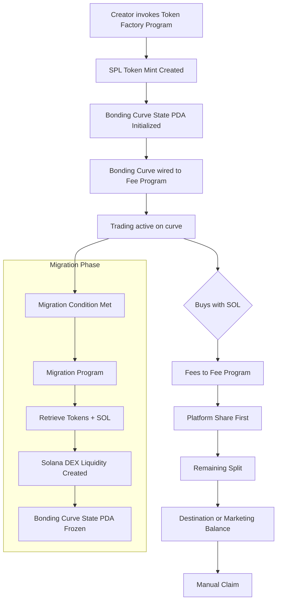

# FartBull

A Solana-native bonding-curve token launchpad.

**Primary Token (CA):** `4uuxPfEdy2ZHhgux9zrRHtsbVx9yrnDrtLLAPWhmdKSE`
**Chain:** Solana (`mainnet-beta`) · **Token Standard:** SPL Token · **Native Asset:** SOL

**Website:** `https://fartbull.xyz` · **X:** `https://x.com/fartbullssol` · **API:** `https://api.fartbull.xyz`

---

## Canonical Protocol Reference

| Field | Value |
|---|---|
| Project | FartBull |
| Launch mechanism | Bonding Curve |
| Blockchain | Solana (`mainnet-beta`) |
| Native asset | SOL (1 SOL = 1,000,000,000 lamports) |
| Token standard | SPL Token (standard, not Token-2022) |
| Token CA | `4uuxPfEdy2ZHhgux9zrRHtsbVx9yrnDrtLLAPWhmdKSE` |
| Website | `https://fartbull.xyz` |
| X / Twitter | `https://x.com/fartbullssol` |
| API | `https://api.fartbull.xyz` |
| Explorer | `https://solscan.io` |
| Post-migration DEX | Solana DEX / AMM (`TBD`) |

---

## Quick Navigation

| # | Document | Purpose |
|---|----------|---------|
| 0 | **PROTOCOL.md** | Source of truth — architecture, invariants, scope |
| 1 | **README.md** | This file — executive overview and navigation |
| 2 | **ARCHITECTURE.md** | System architecture, programs, PDAs, modules, data flow |
| 3 | **PROGRAMS.md** | Solana program specifications |
| 4 | **BONDING_CURVE.md** | Linear bonding curve mechanics |
| 5 | **FEE_PROGRAM.md** | Fee collection, routing, and claim mechanics |
| 6 | **MIGRATION.md** | Liquidity migration to Solana DEX |
| 7 | **TOKEN_MODEL.md** | Token model & lifecycle |
| 8 | **GOVERNANCE.md** | Top-100 snapshot governance + CTO recovery |
| 9 | **AGENT_SYSTEM.md** | Autonomous agent PDA architecture |
| 10 | **ASSET_REGISTRY.md** | Asset registry concept (stock-linked, crypto, etc.) |
| 11 | **SECURITY.md** | Security architecture and threat model |
| 12 | **MARKETING.md** | Marketing ledger and governance |
| 13 | **SOCIAL_REGISTRY.md** | Identity verification system |
| 14 | **API.md** | REST and WebSocket API reference |
| 15 | **DIAGRAMS.md** | All Mermaid system diagrams |
| 16 | **ROADMAP.md** | Development roadmap |
| 17 | **LORE.md** | Project lore and brand voice |
| 18 | **TODO.md** | Open architectural questions |
| 19 | **DOCUMENTATION_STATUS.md** | Documentation status dashboard |

All documents reference [PROTOCOL.md](./PROTOCOL.md) as the source of truth. If any conflict arises, PROTOCOL.md supersedes all other documents.

---

## Protocol Overview

FartBull is a **bonding-curve launchpad protocol** natively built on Solana that enables creators to launch SPL tokens with:

### Core Features

1. **Linear Bonding Curve**
   - Deterministic price discovery with integral cost calculations
   - Immutable parameters after deployment
   - Trading phase with linear price increase

2. **Shared Fee Program**
   - Single protocol program services all tokens
   - Isolated per-token accounting via PDA state accounts (no cross-token mixing)
   - Platform revenue taken first, then marketing/destination split

3. **Optional Marketing**
   - 20% of net fees allocated to marketing when enabled (creator can disable)
   - Initial $299 USD auto-reserved for DEX Screener Token Enhancement
   - Community-governed spend proposals after the initial allocation

4. **Claim-Based Distribution**
   - Fees accumulate on-chain in program-controlled PDA vault accounts
   - Recipients manually claim via the Fee Program's claim instruction
   - No automatic transfers to destination wallets

5. **Social Identity Verification**
   - Multi-platform verification (X/Twitter, Discord, GitHub, etc.)
   - Verified identities register as fee destinations
   - Claim-based payout distribution

6. **Automated Liquidity Migration**
   - Seamless transition from bonding curve to a Solana DEX
   - Fee processing continues via the Fee Program after migration

7. **Stock Pairing (Optional / Future)**
   - An optional module for tokenized real-world asset integration
   - Not required for core launchpad functionality

8. **Agent System (Future)**
   - Autonomous agents whose on-chain identity is a program-controlled PDA
   - Agent permissions are programmatically enforced (least privilege)

---

## Token Supply Allocation

| Allocation | Amount | Purpose |
|------------|--------|---------|
| **Bonding Curve** | 800,000,000 | Trading during curve phase |
| **Liquidity Migration** | 200,000,000 | Solana DEX liquidity after migration |
| **Total** | 1,000,000,000 | Fixed supply |

> Token amounts are expressed in **token base units** (1 token = 10^decimals base units). The 1,000,000,000 figure above is the human-readable supply, not lamports or raw SPL base units. Total supply is fixed at mint creation and is not reducible.

This is supply allocation, not fee distribution. These numbers represent where the 1B token supply is allocated, not how trading fees are routed.

---

## Fee Architecture

```
Gross Trade Fee
↓
Fee Program receives 100% (SOL / lamports)
↓
Platform Share (protocol, deducted first)
↓
Remaining Creator Fee
↓
Marketing Enabled? → Yes: 80% Destination, 20% Marketing
                  No: 100% Destination
↓
Manual Claim via Fee Program
```

Fees are denominated in **SOL** (lamports). All fee accounting occurs in PDA-controlled state and vault accounts owned by the Fee Program.

---

## Governance Scope

Governance is intentionally limited to two areas:

1. **Marketing proposals** — per-token marketing spend voting (top 100 holders, snapshot-based)
2. **CTO recovery** — community approval to redirect fee destinations after a legitimate community takeover

Governance does **not** control protocol upgrades, fee parameters, or program configuration.

Solana token holder balances are resolved from SPL **token accounts** / **Associated Token Accounts** associated with the token mint. The governance system must resolve token accounts to their owners correctly — do not assume single-account-per-owner semantics; an owner may hold tokens across multiple token accounts.

---

## System Architecture

```mermaid
graph TD
    subgraph "Application Layer"
        A1[Frontend (fartbull.xyz)]
        A2[API (api.fartbull.xyz)]
    end

    subgraph "On-Chain (Solana)"
        A2 --> B1[Token Factory Program]
        B1 --> B2[SPL Token Mint<br/>via SPL Token Program]
        B1 --> B3[Bonding Curve State PDA]
        B3 --> B4[Fee Program]
        B3 --> B5[Migration Program]
        B5 --> B6[Solana DEX / AMM]
        B4 --> B7[Social Registry Program]
        B1 --> B8[Agent PDA]
        B1 --> B9[Asset Registry PDA]
    end

    style A1 fill:#e8f4fd
    style B1 fill:#fff3e0
    style B2 fill:#fff3e0
    style B3 fill:#fff3e0
    style B4 fill:#e8f5e9
    style B5 fill:#e8f5e9
    style B6 fill:#e8f5e9
    style B7 fill:#e8f5e9
    style B8 fill:#e8f5e9
    style B9 fill:#e8f5e9
```

---

## Launch Lifecycle



---

## Technical Stack

| Layer | Technology |
|-------|------------|
| **Blockchain** | Solana (`mainnet-beta`) |
| **Programs** | Rust (`TBD` — Anchor or native Rust) |
| **Token Standard** | SPL Token Program (standard, not Token-2022) |
| **Token Metadata** | `TBD — metadata implementation` (Metaplex Token Metadata if adopted) |
| **Frontend** | `https://fartbull.xyz` |
| **API** | `https://api.fartbull.xyz` |
| **UI Library** | React + Solana wallet adapters |
| **Styling** | Tailwind CSS 3.x |

> **Framework note:** The implementation has not yet selected Anchor vs native Rust. `TBD — Solana program framework`.

---

## Safety Features

### Program Design

- **Shared protocol programs** — single Fee Program and Migration Program, used across all tokens
- **Non-custodial** — users control their own wallets and private keys at all times
- **Claim-based distribution** — no automatic transfers; recipients withdraw on demand
- **Check-effects-interactions** — state validated before external calls (via CPI ordering)
- **Immutable curve parameters** — curve settings cannot be changed after launch
- **Account validation** — every instruction validates account ownership, mint, and PDA derivation
- **PDA-controlled vaults** — fee reserves held in program-controlled PDA accounts
- **Agent least-privilege** — agents operate with narrowly-scoped, program-enforced permissions

---

## Solana-Native Architecture

```
User Wallet
     |
     v
FartBull Frontend
     |
     v
FartBull Programs
     |
     +----------------------+
     |                      |
     v                      v
Bonding Curve State PDA    Fee/Protocol State PDA
     |
     v
SPL Token Mint / Token Accounts
     |
     v
Solana DEX Migration
```

### Accounts & PDAs

| Solana Concept | Description |
|-----------------|-------------|
| Token mint | SPL Token Mint (via SPL Token Program) |
| Token balance | Token Account / Associated Token Account |
| Program state | PDA state account (program-owned) |
| Program vault | PDA vault account (program-controlled) |
| Agent identity | Agent PDA (program-controlled) |
| Asset entry | Asset Registry PDA (program-controlled) |
| Program ID | Pubkey identifying an executable account |
| Transaction signer | The wallet that signed the transaction |
| Lamports transfer | SOL (lamports) sent with the instruction |

Program IDs, PDA seeds, mint addresses, vault addresses, and DEX addresses are all **TBD** and will be published at deployment. Do not fabricate Solana addresses.

---

## FartBull Conceptual Modules

The protocol is designed as a collection of Solana programs and PDA state, organized into modules for separation of concerns:

| # | Module | On-Chain Representation |
|---|--------|------------------------|
| 1 | Token Launch | Token Factory Program |
| 2 | Bonding Curve | Bonding Curve Program + State PDA |
| 3 | Fee Management | Fee Program + per-token PDAs |
| 4 | Migration | Migration Program + LP handling |
| 5 | Governance | Governance Program + snapshot voting |
| 6 | Agent System | Agent PDA managed by FartBull Program |
| 7 | Asset Registry | Asset Registry PDA |
| 8 | Social Registry | Social Registry Program + identity PDAs |

See [ARCHITECTURE.md](./ARCHITECTURE.md) for the full architectural overview.

---

*Source of truth: [PROTOCOL.md](./PROTOCOL.md)*
