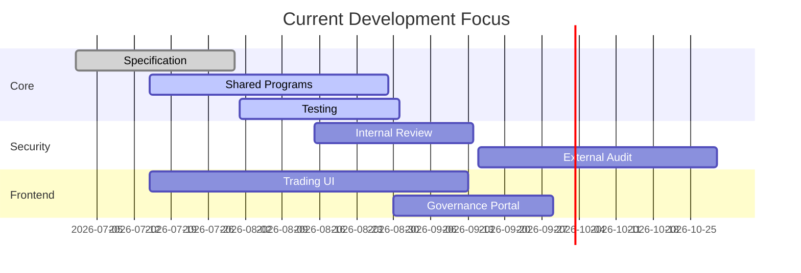

# FartBull — Roadmap

See [PROTOCOL.md](./PROTOCOL.md) for the authoritative protocol specification. This document outlines the development roadmap and future direction.

**Chain:** Solana (`mainnet-beta`) · **Token Standard:** SPL Token · **Native Asset:** SOL (lamports)

---

## Table of Contents

1. [Development Phases](#development-phases)
2. [Current Status](#current-status)
3. [Upcoming Milestones](#upcoming-milestones)
4. [Future Direction](#future-direction)

---

## Development Phases

### Phase: Specification
**Objective:** Establish canonical protocol architecture and invariants

- Canonical specification on Solana (SPL Token, programs, PDAs)
- Shared Fee Program architecture (per-token PDA isolation, claim-based)
- Bonding curve launch mechanism and Solana DEX migration path
- Top-100 snapshot governance and CTO recovery model
- Agent System conceptual architecture (least-privilege permissions)
- Asset Registry conceptual architecture (future module)
- Status: Completed

### Phase: Program Implementation
**Objective:** Implement and verify core Solana programs

- Token Factory Program, Bonding Curve Program
- Shared Fee Program (single deployment, per-token PDA accounting)
- Migration Program (Solana DEX)
- Social Registry Program
- Governance Program
- Agent System Program (future phase)
- Asset Registry Program (future phase)
- Status: In Progress

### Phase: Security
**Objective:** Validate protocol security

- Static analysis (`cargo clippy`, `cargo audit`)
- Internal security review
- External audit engagement
- Status: Planned

### Phase: Deployment
**Objective:** Production deployment and ecosystem activation

- Localnet testing
- Devnet deployment on Solana
- Program verification on Solscan
- Mainnet-beta deployment
- Governance activation
- Status: Planned

---

## Current Status

The protocol is specified and documented for Solana. Program implementation and devnet deployment are forthcoming. This documentation reflects the canonical architecture; implementation values (migration threshold, DEX selection, liquidity position representation, governance threshold, program IDs, PDA seeds) remain TBD where not yet finalized.

### In Progress



---

## Upcoming Milestones

| Milestone | Target | Status |
|-----------|--------|--------|
| Security Review | Q3 2026 | Planned |
| External Audits | Q4 2026 | Planned |
| Devnet Launch | Q4 2026 | Planned |
| Mainnet-beta Deployment | Q1 2027 | Planned |
| Governance Activation | Q1 2027 | Planned |
| Agent System Implementation | Q2 2027 | Future |
| Asset Registry Implementation | Q2 2027 | Future |

---

## Network Progression

The deployment follows Solana's cluster progression:

```
Localnet
   ↓
Devnet
   ↓
Testnet / staging
   ↓
Mainnet-beta
```

**Localnet** — Local Solana validator for development and testing.

**Devnet** — Shared test cluster for integration testing with recoverable accounts.

**Testnet** — Shared cluster for staging and pre-production validation.

**Mainnet-beta** — Production cluster. Program deployment is final; upgrade authority revocation (for immutability) should occur after audit completion.

---

## Governance Timeline

| Activity | Timing |
|----------|--------|
| Governance program deployment | After implementation and audits |
| Snapshot voting launch | After mainnet |
| First marketing proposal | 30 days post-mainnet |
| CTO recovery mechanism | Available from launch |

Solana has no prior chain migration. The architecture is natively Solana from specification onward.

---

## Future Direction

### Beyond 2027

| Objective | Timeline | Description |
|-----------|----------|-------------|
| Governance Portal | Q1 2027 | DAO dashboard for proposals and voting |
| Agent System | Q2 2027 | On-chain agent PDA management and permissions |
| Asset Registry | Q2 2027 | Asset registry for stock-linked and crypto assets |
| Ecosystem Growth | 2027 | Community campaigns and partnerships |

### Governance Scope (unchanged)

Governance remains scoped to:

1. **Marketing proposals** — per-token marketing spend decisions
2. **CTO recovery** — community takeover fee destination redirects

Protocol configuration, upgrades, and parameter changes remain outside governance scope and are handled by protocol administration.

---

## Risk Mitigation

### Timeline Risks

| Risk | Mitigation |
|------|------------|
| Audit Delays | Parallel engagement with multiple firms |
| Testnet Issues | Extended testing window |
| Regulatory Changes | Legal consultation |

### Community Risks

| Risk | Mitigation |
|------|------------|
| Low Participation | Incentive programs for early adopters |
| Governance Attacks | Snapshot-based top-100 voting + quorum |
| Negative Sentiment | Transparent communication |

---

*Roadmap last updated: August 2026*
*Next update: October 2026*
*Source of truth: [PROTOCOL.md](./PROTOCOL.md)*
