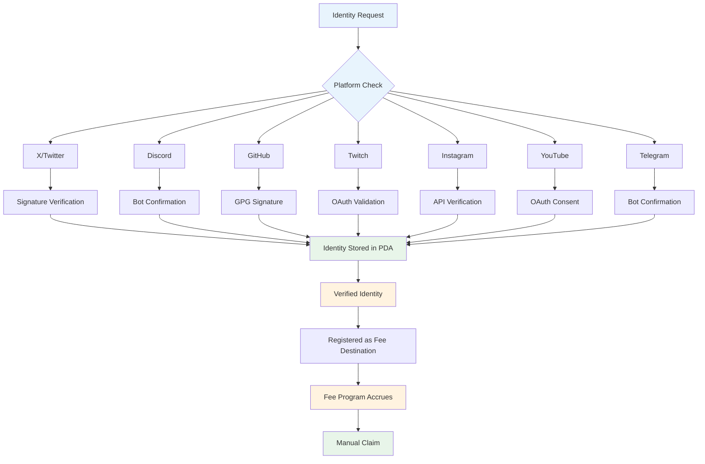
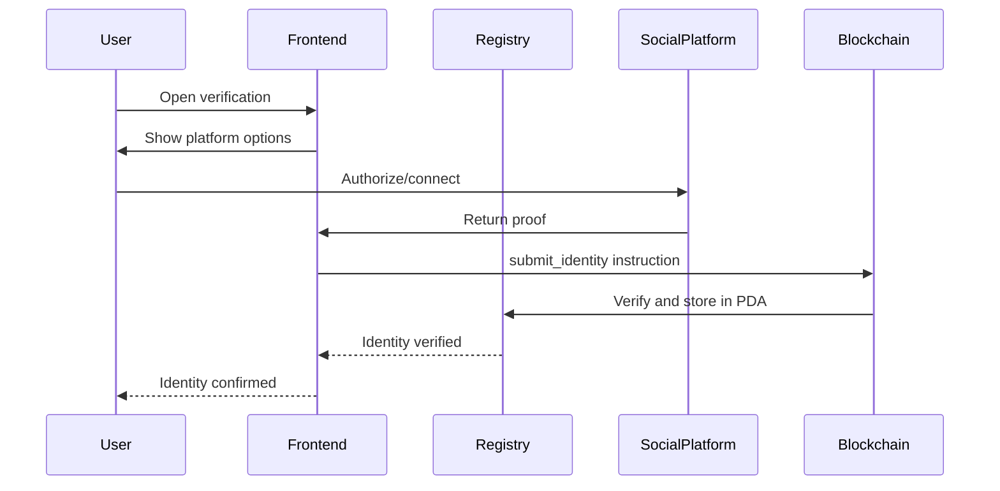
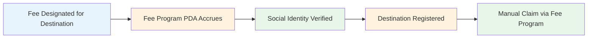

# FartBull — Social Registry

See [PROTOCOL.md](./PROTOCOL.md) for the authoritative protocol specification. This document covers the social identity verification system.

**Chain:** Solana (`mainnet-beta`) · **Token Standard:** SPL Token · **Native Asset:** SOL (lamports)

---

## Overview

### Purpose

The Social Registry provides verifiable identity management for social media accounts on Solana. Verified identities can be registered as fee destinations in the Fee Program. Fees accrue to the Fee Program's per-token PDA, and recipients claim manually.

The Social Registry handles:

- Identity verification
- Social account association
- Wallet association
- Verification status

It does **not** become the fee accounting system. The Fee Program remains responsible for balances. The relationship is:

```
Social Identity
      |
      v
Verified Destination
      |
      v
Fee Program (PDA)
      |
      v
Accumulated Balance
      |
      v
Claim (instruction)
```

### Core Features

1. **Multi-Platform Verification** — Support for major social media platforms
2. **On-Chain Identity** — Blockchain-verifiable identity records in PDA state
3. **Claim-Based Distribution** — Fees accumulate in Fee Program PDA; recipients claim manually
4. **Authorized Registration** — Identity admin manages platform enablement

---

## Architecture

### System Overview



### On-Chain vs Off-Chain Boundaries

The social identity system spans both on-chain and off-chain layers:

```
User
 ↓
Frontend (fartbull.xyz)
 ↓
Authentication provider
 ↓
API (api.fartbull.xyz)
 ↓
Social Registry Program (on-chain PDA)
 ↓
Wallet / escrow relationship
```

- **Frontend** handles user interaction and platform OAuth/sign-on flows
- **API** verifies social identity proofs off-chain
- **Social Registry Program** stores the verified relationship on-chain as a PDA
- **Fee Program** uses the verified identity as a registered claim destination

**OAuth secrets and private credentials must NEVER be stored on-chain.** Only the verification result (wallet + platform + handle + status + timestamp) is stored in PDA state. Social identity is an identity/verification layer, not a wallet equivalent.

### Data Model (PDA State)

Identity records are stored in PDA state accounts owned by the Social Registry Program:

| Field | Type | Description |
|-------|------|-------------|
| `wallet` | Pubkey | Verified wallet address |
| `verified` | bool | Verification status |
| `last_update` | u64 | Last verification timestamp (Unix) |
| `platform` | String | Platform identifier (e.g. "twitter", "discord") |
| `handle` | String | Social media handle |
| `identity_id` | Pubkey | PDA bump for identity lookup |

Identity records are stored as individual PDA accounts or as a list within a registry PDA. Account substitution is prevented by PDA derivation validation.

### Escrow PDA Pattern

Verified social identities may optionally be registered through a **program-controlled escrow PDA**:

```
Social Registry Program
      |
      +--> Escrow PDA (for identity verification)
      |
      +--> Identity PDA (verified identity record)
      |
      +--> Claim destination in Fee Program PDA
```

The actual mechanism must remain TBD if not yet implemented:

```
TBD — social registry escrow mechanism
```

Do not invent exact PDA seeds unless the implementation has already defined them.

---

## Identity Verification

### Verification Methods

Each platform uses a specific verification mechanism. Verification occurs off-chain via an oracle, with on-chain state recording the result:

| Platform | Method | Proof Required |
|----------|--------|----------------|
| X/Twitter | Solana signed message | Signed message proof |
| Discord | Bot role confirmation | Direct message verification |
| GitHub | Commit signature verification | Signature proof |
| Twitch | OAuth token validation | Channel ownership proof |
| Instagram | API verification | Page access token |
| YouTube | OAuth consent | Channel ownership proof |
| Telegram | Bot confirmation | Command response |

### Signature Verification

For signature-based platforms (X/Twitter), verification uses Solana signed messages:

```
verify_signature(
    wallet: Pubkey,
    platform: String,
    handle: String,
    nonce: u64,
    signature: Vec<u8>
):
    message = construct_verification_message(wallet, platform, handle, nonce)
    recovered_pubkey = solana_sdk::signature::recover(&message, &signature)
    return recovered_pubkey == wallet
```

Solana uses `secp256k1_instruction` or `ed25519_instruction` for signature verification.

### Nonce-Based Replay Protection

Each verification request includes a nonce:

- The Social Registry PDA increments a nonce counter per wallet
- The nonce is included in the signed message
- The program rejects duplicate nonces
- This prevents replay attacks

---

## Supported Platforms

### Tier 1 (Full Support)

| Platform | Verification | Payout | Status |
|----------|--------------|--------|--------|
| X/Twitter | Signature | Yes | Production |
| Discord | Bot | Yes | Production |
| GitHub | Signature | Yes | Production |

### Tier 2 (Partial Support)

| Platform | Verification | Payout | Status |
|----------|--------------|--------|--------|
| Twitch | OAuth | Limited | Development |
| Instagram | API | Limited | Development |
| YouTube | OAuth | Limited | Development |
| Telegram | Bot | Limited | Development |

---

## Registration Flow

### User Journey



### Step-by-Step Process

1. **Platform Selection**
   - User selects desired social platform
   - Frontend generates a unique nonce
   - Nonce displayed for proof

2. **Proof Generation**
   - User proves ownership via the platform method
   - Proof returned to frontend
   - Proof includes nonce and platform ID

3. **On-Chain Submission**
   - Frontend submits to the Social Registry Program
   - Program validates signature/membership
   - Identity stored in PDA state with timestamp

4. **Verification Confirmation**
   - Identity verification event emitted (log)
   - Identity available as fee destination
   - Verification status set to confirmed

---

## Fee Destination Registration

### Overview

The Social Registry does **not** automatically distribute fees. Instead:

1. Verified social identities register a claim destination in the Fee Program
2. Fees designated for the destination accrue to the Fee Program PDA
3. Recipients call `claim_destination` on the Fee Program

### Flow



---

## Escrow / Claim System

### Concept

Social identities may have associated escrow/claim accounts. A user authenticates through the frontend. The backend verifies the social identity. The user can then claim assets associated with that verified identity.

### Architecture

The actual claim authority and asset custody must be enforced by Solana programs:

```
User authenticates
      ↓
Frontend (fartbull.xyz)
      ↓
Authentication provider (OAuth / signed message)
      ↓
API verifies identity (api.fartbull.xyz)
      ↓
Social Registry PDA (verified identity recorded on-chain)
      ↓
Fee Program PDA (destination balance accrues)
      ↓
User calls claim_destination instruction
      ↓
System Program CPI transfers SOL to claimant
```

### Claim Authorization

The claim instruction validates:

1. The claimant is the verified identity owner (signer check)
2. The Fee Config PDA has a non-zero destination balance
3. The Fee Config PDA's destination field matches the claimant

Do not invent exact claim mechanisms yet.

---

## Security Model

### Verification Security

| Threat | Mitigation |
|--------|-------------|
| Sybil Attack | Unique wallet requirement |
| Identity Theft | Signature verification |
| Fake Accounts | Bot confirmation process |
| Replay Attack | Nonce-based proofs |

### Wallet Splitting / Sybil Limitation

Snapshotting and registration on Solana prevent manipulation of the eligible voter set during an active vote.

Document this honestly: the verification system does **not** magically identify every wallet controlled by the same human. A person can potentially split holdings across addresses before registration. There is no on-chain identity binding that perfectly detects shared ownership.

### Access Control (PDA-based)

```
register_identity instruction:
    verify PDA derivation (identity PDA seeds)
    verify wallet is signer
    verify nonce is unused
    verify signature or bot proof
    store identity in PDA state
    emit IdentityVerified event (log)
```

Solana programs validate via explicit instruction logic. Identity verification is stored in PDA state and checked by the calling program via CPI.

---

## Privacy Policy

### Data Handling

The registry stores minimal on-chain data in PDA accounts:

- **Stored On-Chain:** Wallet address (Pubkey), platform ID, timestamp, verification status
- **NOT Stored:** Personal details, private messages, full credentials

### Privacy by Design

Only verification-relevant data is stored. No message content, email addresses, or personal identifiers are stored on-chain. Identity PDAs are owned by the Social Registry Program and can only be modified via verified instruction paths.

---

*Social registry documentation last updated: August 2026*
*Next review: October 2026*
*Source of truth: [PROTOCOL.md](./PROTOCOL.md)*
