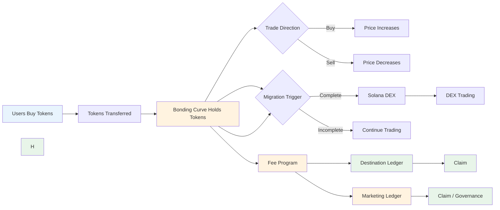

# FartBull — Token Model & Lifecycle

See [PROTOCOL.md](./PROTOCOL.md) for the authoritative protocol specification. This document covers the SPL token model, supply allocation, and lifecycle.

**Chain:** Solana (`mainnet-beta`) · **Token Standard:** SPL Token · **Native Asset:** SOL (lamports)

> The conceptual title of this document is **Token Model & Lifecycle**. The filename `TOKEN_MODEL.md` replaces the legacy `TOKENOMICS.md` to cleanly separate supply/economic design from technical token handling.

---

## Table of Contents

1. [Supply Allocation](#supply-allocation)
2. [Token Lifecycle](#token-lifecycle)
3. [Fee Structure](#fee-structure)
4. [Price Discovery](#price-discovery)
5. [Migration Liquidity](#migration-liquidity)
6. [Supply Accounting](#supply-accounting)
7. [Risk Considerations](#risk-considerations)
8. [SPL Token Model](#spl-token-model)

---

## Supply Allocation

### Fixed Launch Supply

Each token launched through FartBull has a fixed, deterministic supply:

```
Total Supply = 1,000,000,000 tokens
```

| Allocation | Amount | Purpose |
|------------|--------|---------|
| **Bonding Curve** | 800,000,000 | Trading during curve phase |
| **Liquidity Migration** | 200,000,000 | Solana DEX liquidity after migration |
| **Total** | 1,000,000,000 | Fixed supply |

> Token amounts are expressed in **token base units** (1 token = 10^decimals base units). With `decimals = 9`, the total mint supply in base units is `1,000,000,000 × 10^9 = 1,000,000,000,000,000,000`. The mint total supply is fixed at creation and cannot be increased. The 1,000,000,000 figure above is the human-readable supply, not lamports.

This is supply allocation, not fee distribution. These numbers represent where the 1B token supply is allocated, not how trading fees are routed.

### Key Properties

- Supply allocation is **not** fee distribution. It is the physical token split between trading and liquidity.
- No pre-minted supply allocated to teams, treasuries, or private parties.
- No presales or private sales.
- No team allocations or vesting schedules.
- All tokens are equally accessible through the bonding curve.

### Supply Distinctions

The documentation distinguishes the following supply categories:

| Term | Description |
|------|-------------|
| **Total Mint Supply** | 1,000,000,000 (fixed at mint creation) |
| **Curve Allocation** | 800,000,000 (trading during curve phase) |
| **Migration/Liquidity Allocation** | 200,000,000 (DEX liquidity after migration) |
| **Migration Buffer** | Subset of the 200,000,000 allocation; handles final in-flight buys and migration boundary conditions |
| **Burned / Unissued Tokens** | Tokens from the migration buffer not used for liquidity, if any |

The migration buffer is a controlled subset of the 200,000,000 migration allocation, not unrestricted curve inventory. See [BONDING_CURVE.md](./BONDING_CURVE.md) for details on the final-buy protection and buffer handling.

### Burn Model

The burn mechanism uses the SPL Token Program's native burn facility to reduce circulating supply. Burning requires:

- A token account holding the tokens to be burned
- The mint's burn authority (or a delegated authority) to sign the burn instruction

**Burn Authority**: `TBD — burn destination`

If the project specifically wants an unrecoverable Solana address for burns, document the mechanism only after the actual design is selected. Do not invent a dead-wallet address.

Do NOT describe burning tokens by sending them to an arbitrary unrecoverable address as the only possible burn mechanism. The SPL burn instruction reduces the mint's total supply directly.

---

## Token Lifecycle

### 1. Creation

A creator invokes the **Token Factory Program**. The factory creates an **SPL Token Mint** via the SPL Token Program and initializes a **Bonding Curve State PDA** with curve parameters. The full 1,000,000,000 token supply is minted to the creator's associated token account at mint creation.

### 2. Curve Trading

Users buy tokens from the Bonding Curve State PDA using SOL. Price follows the linear formula:

```
Price(s) = basePrice + slope × sold
```

All prices and costs are denominated in **lamports**. Trading fees are credited to the Fee Program's per-token PDA. This phase continues until the migration condition is met.

### 3. Migration

When the bonding curve reaches its configured migration condition (`TBD`), the Migration Program creates a liquidity position on a Solana DEX (`TBD — DEX selection`) and freezes the Bonding Curve State PDA. See [MIGRATION.md](./MIGRATION.md).

### 4. DEX Trading

After migration, the token trades on a Solana DEX (`TBD — DEX selection`). Trading fees generated by the DEX continue flowing to the Fee Program, where they are processed identically to the curve phase.

### 5. Claim & Governance

Throughout and after launch, fee recipients claim accumulated SOL balances from the Fee Program PDA accounts. Top 100 holders may participate in marketing and CTO governance proposals.

---

## Fee Structure

### Overview

Fees are generated on every trade and processed through the shared **Fee Program**. See [FEE_PROGRAM.md](./FEE_PROGRAM.md) for full implementation details.

### Fee Architecture

```
Gross Trade Fee (lamports, 1–5% of trade)
↓
Protocol Share (protocol revenue, taken first)
↓
Net Fee (remaining after protocol share)
↓
Marketing Split (optional, 20% of net fee)
↓
Destination Ledger (80% or 100% of net fee)
```

### Components

| Component | Range | Purpose |
|-----------|-------|---------|
| Trading Fee | 1–5% (100–500 BPS) | Collected per trade on the Bonding Curve |
| Protocol Fee | Configurable (default 2%) | Protocol revenue (deducted first) |
| Marketing Split | 0% or 20% of net fee | Marketing ledger (optional) |
| Destination | 80% or 100% of net fee | Creator-selected routing |

### Fee Rate Selection

Creators set the trading fee rate:

- **Minimum:** 1% (100 basis points)
- **Maximum:** 5% (500 basis points)
- **Default:** 2% (200 basis points)

### Platform Revenue

The Fee Program fee is a protocol-level percentage deducted from every gross trade fee, **before** the marketing split. The marketing 20/80 split applies only to the remaining amount. The protocol fee is unrelated to the 200,000,000 token supply allocation.

---

## Price Discovery

### Bonding Curve Price Formula

```
Price(s) = basePrice + slope × sold
```

Where:
- `P(s)` = Current price per token (lamports per token base unit)
- `basePrice` = Starting price (set by creator, in lamports)
- `slope` = Price increase per token sold (set by creator, in lamports)
- `sold` = Total tokens sold to date (in base units)

### Integral for Trade Cost

To buy `x` tokens when `n` already sold:

```
Cost = basePrice × x + slope × x × (n + x/2)
```

All values in lamports and token base units — no floating point.

---

## Migration Liquidity

### Liquidity Source

Liquidity on a Solana DEX comes from:

1. **Bonding Curve SOL Balance** — All SOL (lamports) collected from sales, held in the Curve State PDA vault
2. **Token Balance** — Unsold tokens at migration time (from the 200,000,000 migration allocation)

### Liquidity Position Handling

When migration occurs:

1. Migration Program retrieves all SOL (lamports) from the Bonding Curve State PDA vault
2. Migration Program retrieves all tokens from the curve's token vault
3. Liquidity is added to a Solana DEX position (`TBD — DEX selection`) (SOL + tokens)
4. The Bonding Curve State PDA is marked as graduated

The specific representation and custody of the Solana DEX liquidity position (fungible LP tokens, NFT positions, position accounts, PDAs, or program-owned liquidity) are **TBD — DEX liquidity-position model**. Do **not** describe the position as "burned" unless the canonical implementation confirms it.

---

## Supply Accounting



---

## Risk Considerations

### Creator Risk Model

| Risk | Description | Mitigation |
|------|-------------|------------|
| No Pre-Sales | Must rely on organic interest | Enable marketing for visibility |
| Competitive Curve | Other tokens compete | Optimize price parameters |
| Migration Timing | Must hit thresholds | Set realistic targets |
| Fee Dependence | Success depends on fee choice | Balance destination + marketing |

### User Risk Model

| Risk | Description | Impact |
|------|-------------|--------|
| Price Volatility | Curve prices change | Buy/sell timing |
| Migration Risk | Cannot predict DEX launch | Supply/demand shift |
| No Liquidity Guarantee | If migration fails, no DEX | Capital at risk |

---

## SPL Token Model

FartBull uses the **standard SPL Token Program** (not Token-2022). Each launch creates:

```
SPL Mint
    |
    +--> Token Accounts (holders)
    |
    +--> Associated Token Accounts (ATAs)
    |
    +--> Metadata Account (TBD — metadata implementation)
```

### Token Standard Decision

Unless the existing project specification requires Token-2022 functionality:

**Use the standard SPL Token program.**

Do NOT introduce Token-2022 extensions simply because they exist. Token-2022 is documented as an OPTIONAL / FUTURE enhancement only:

```
Token-2022: OPTIONAL / FUTURE — not part of current design
```

### Token Metadata

Standard SPL Token functionality does not itself provide token name/symbol/image metadata. Solana documentation describes Metaplex Token Metadata as a metadata account associated with the token mint.

```
SPL Mint
    |
    +--> Token Accounts
    |
    +--> Metadata Account (TBD — metadata implementation)
```

If FartBull adopts Metaplex metadata, it will be documented explicitly. If the implementation has not yet selected a metadata system:

```
TBD — metadata implementation
```

---

*Token model & lifecycle documentation last updated: August 2026*
*Next review: October 2026*
*Source of truth: [PROTOCOL.md](./PROTOCOL.md)*
